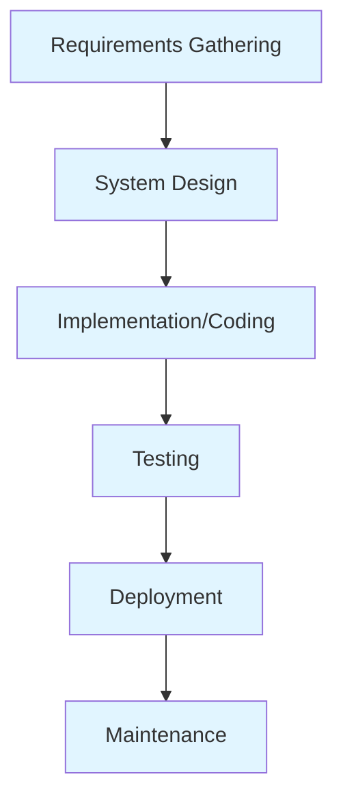
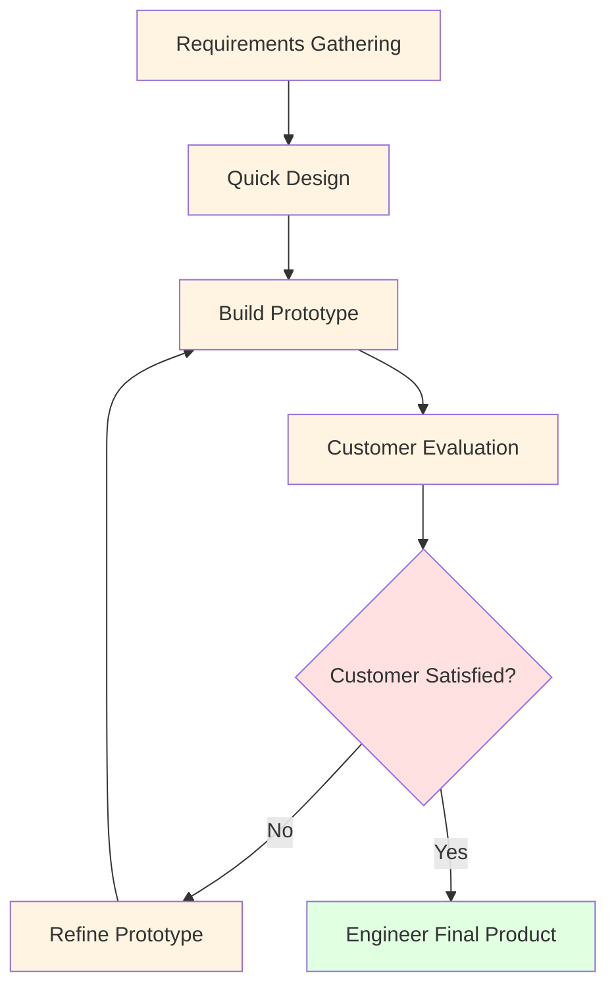
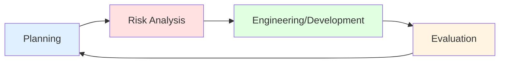
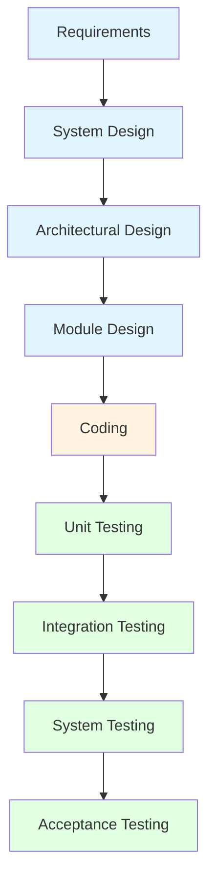
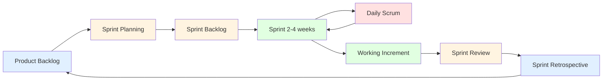
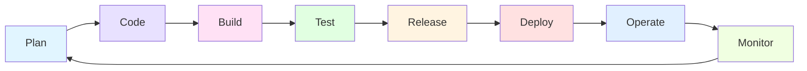

# SDLC Models - Complete Guide

## 📚 Learning Objectives
- Understand different Software Development Life Cycle models
- Identify when to use each model based on project characteristics
- Compare advantages and disadvantages of each model
- Apply appropriate SDLC model to real-world scenarios

---

## 1. What is SDLC?

**Software Development Life Cycle (SDLC)** is a systematic process for developing high-quality software in a structured and organized manner. It defines the sequence of activities performed during software development.

### Why SDLC?
- Provides a structured framework
- Ensures quality and completeness
- Facilitates project planning and tracking
- Reduces development risks
- Improves communication among stakeholders

---

## 2. Waterfall Model 🌊

### Description
The Waterfall Model is a **linear sequential** approach where each phase must be completed before moving to the next. There is **no overlapping** of phases, and **going back is difficult**.

### Phases (in sequence):
```
Requirements → Design → Implementation → Testing → Deployment → Maintenance
```

### Mermaid Diagram:


### Advantages:
| Advantage | Explanation |
|-----------|-------------|
| Simple & Easy | Easy to understand and use |
| Well Documented | Each phase has specific deliverables |
| Works for Small Projects | Good when requirements are clear |
| Easy to Manage | Phases are processed one at a time |

### Disadvantages:
| Disadvantage | Explanation |
|--------------|-------------|
| No Going Back | Difficult to accommodate changes |
| Late Testing | Testing starts only after implementation |
| High Risk | Not suitable for complex projects |
| Working Software Late | Working model available only at the end |

### When to Use:
✅ Requirements are well understood and stable  
✅ Project is short  
✅ Technology is understood  
✅ No ambiguous requirements  

**Example**: Developing a payroll system for a small company with fixed rules.

### Exam Tip:
Waterfall is also called **Classic Life Cycle** or **Linear Sequential Model**. Remember: **High risk, low flexibility**.

---

## 3. Prototyping Model 🔧

### Description
A **prototype** is a working model of the software with limited functionality. The prototype is built, shown to the customer, refined based on feedback, and this cycle continues until the customer is satisfied.

### Phases:
```
Requirements Gathering → Quick Design → Build Prototype → Customer Evaluation → Refine Prototype → Engineer Product
```

### Mermaid Diagram:


### Types of Prototypes:
| Type | Description | Example |
|------|-------------|---------|
| **Throwaway** | Discarded after requirements clarification | Paper wireframes |
| **Evolutionary** | Refined into final product | Incremental web app |
| **Incremental** | Multiple prototypes combined | E-commerce modules |
| **Extreme** | User interacts directly with prototype | Mobile app demo |

### Advantages:
- Early user feedback
- Reduced risk of failure
- Better requirement understanding
- Users actively involved
- Missing functionalities detected early

### Disadvantages:
- May lead to scope creep
- Expensive process
- Users may confuse prototype with final system
- Developer may use quick-and-dirty approaches
- Too many iterations possible

### When to Use:
✅ Requirements are unclear or changing  
✅ User interaction is critical  
✅ Innovative product with unknown features  
**Example**: Developing a new social media app where user experience is crucial.

---

## 4. Spiral Model 🌀

### Description
The Spiral Model combines **iterative development** with **systematic aspects of Waterfall**. It emphasizes **risk analysis** and is represented as a spiral with multiple cycles (loops).

### Four Quadrants:
1. **Determine Objectives** - What to achieve?
2. **Identify & Resolve Risks** - Risk analysis and mitigation
3. **Develop & Test** - Build and verify
4. **Plan Next Iteration** - Review and plan

### Mermaid Diagram:


### Spiral Cycles:
- Each loop = One phase
- Inner loops = Early phases
- Outer loops = Later phases
- Risk analysis at each cycle

### Advantages:
- **Excellent for high-risk projects**
- Risk handling is explicit
- Suitable for large projects
- Changes can be accommodated
- Early production of system

### Disadvantages:
- **Complex** and expensive
- Requires **risk assessment expertise**
- Not suitable for small projects
- Time-consuming
- Difficult to manage

### When to Use:
✅ **Large, complex projects**  
✅ **High-risk projects**  
✅ Requirements are unclear  
✅ Significant changes expected  
**Example**: Developing aerospace software, banking systems, or military applications.

### Exam Tip:
Spiral Model was proposed by **Barry Boehm in 1988**. Key differentiator: **Risk Analysis**.

---

## 5. V-Model (Verification & Validation) ✔️

### Description
The V-Model is an **extension of Waterfall** where execution of processes happens in a **V-shape**. Each development phase has a corresponding **testing phase**.

### The V-Shape:
```
Left Side (Development)          Right Side (Testing)
Requirements Analysis    ←→     Acceptance Testing
System Design            ←→     System Testing
Architectural Design     ←→     Integration Testing
Module Design            ←→     Unit Testing
                    Coding
```

### Mermaid Diagram:


### Verification vs Validation:
| Aspect | Verification | Validation |
|--------|--------------|------------|
| **Question** | Are we building the product right? | Are we building the right product? |
| **Type** | Static testing | Dynamic testing |
| **When** | Before validation | After verification |
| **Activities** | Reviews, inspections, walkthroughs | Functional testing, system testing |
| **Finds** | Defects in design | Defects in functionality |

### Advantages:
- Simple and easy to understand
- Testing is planned early
- Defects found early (cost-effective)
- Works well for small-medium projects
- Quality focus throughout

### Disadvantages:
- No early prototypes
- Difficult to accommodate changes
- Not suitable for complex projects
- High risk and uncertainty not handled
- Working software late

### When to Use:
✅ Requirements are clear and fixed  
✅ Sufficient technical resources  
✅ Short to medium projects  
**Example**: Medical device software, embedded systems.

---

## 6. Agile & Scrum Model 🏃

### Description
Agile is an **iterative and incremental** approach that focuses on **continuous delivery**, **customer collaboration**, and **responding to change**. **Scrum** is the most popular Agile framework.

### Agile Manifesto (4 Values):
1. **Individuals and interactions** over processes and tools
2. **Working software** over comprehensive documentation
3. **Customer collaboration** over contract negotiation
4. **Responding to change** over following a plan

### Scrum Framework:

#### Roles:
| Role | Responsibility |
|------|----------------|
| **Product Owner** | Manages product backlog, prioritizes features |
| **Scrum Master** | Facilitates process, removes obstacles |
| **Development Team** | Cross-functional team (5-9 members) |

#### Artifacts:
| Artifact | Description |
|----------|-------------|
| **Product Backlog** | List of all features/requirements |
| **Sprint Backlog** | Selected items for current sprint |
| **Increment** | Working software at end of sprint |

#### Ceremonies (Events):
| Event | Duration | Purpose |
|-------|----------|---------|
| **Sprint** | 2-4 weeks | Time-boxed iteration |
| **Sprint Planning** | 4-8 hours | Plan sprint work |
| **Daily Scrum** | 15 minutes | Daily standup meeting |
| **Sprint Review** | 4 hours | Demo to stakeholders |
| **Sprint Retrospective** | 3 hours | Process improvement |

### Mermaid Diagram - Sprint Cycle:


### Advantages:
- **Highly flexible** to changes
- Continuous delivery of working software
- Customer satisfaction
- Early and predictable delivery
- Improved quality through iterations
- Transparency in process

### Disadvantages:
- Requires experienced team
- Documentation may be neglected
- Scope creep possible
- Not suitable for inexperienced teams
- Difficult to predict final cost/time

### When to Use:
✅ **Requirements change frequently**  
✅ **Need rapid delivery**  
✅ Customer wants active involvement  
✅ Skilled, self-organized team  
**Example**: Web applications, mobile apps, startups.

---

## 7. DevOps Lifecycle ♾️

### Description
DevOps combines **Development (Dev)** and **Operations (Ops)** to shorten the development lifecycle while delivering high-quality software continuously.

### DevOps Stages (Infinity Loop):
```
Plan → Code → Build → Test → Release → Deploy → Operate → Monitor
                    ↻ Continuous Feedback ↺
```

### Mermaid Diagram:


### Key Practices:
| Practice | Description |
|----------|-------------|
| **CI/CD** | Continuous Integration/Continuous Deployment |
| **IaC** | Infrastructure as Code |
| **Monitoring** | Continuous monitoring and logging |
| **Collaboration** | Cross-functional teams |
| **Automation** | Automated testing and deployment |

### Advantages:
- Faster time to market
- Improved collaboration
- Higher quality releases
- Rapid feedback loops
- Continuous delivery

### Disadvantages:
- Cultural change required
- Requires new tools and skills
- Initial implementation cost
- Security challenges
- Not all environments suitable

### When to Use:
✅ **Cloud-based applications**  
✅ **Need frequent releases**  
✅ Large organizations with multiple teams  
**Example**: Netflix, Amazon, Google (continuous deployment).

---

## 8. Comparison Table - All SDLC Models 📊

| Feature | Waterfall | Prototyping | Spiral | V-Model | Agile/Scrum | DevOps |
|---------|-----------|-------------|--------|---------|-------------|--------|
| **Approach** | Linear | Iterative | Iterative | Linear | Iterative | Continuous |
| **Flexibility** | Low | High | High | Low | Very High | Very High |
| **Risk Handling** | Poor | Moderate | **Excellent** | Poor | Moderate | Good |
| **Customer Involvement** | Low | **High** | Moderate | Low | **Very High** | Moderate |
| **Cost** | Low | High | **Very High** | Low | Moderate | Moderate |
| **Documentation** | **Heavy** | Light | Moderate | **Heavy** | Light | Moderate |
| **Testing Phase** | Late | Throughout | Each cycle | Parallel | Each sprint | Continuous |
| **Best For** | Small, clear req. | Unclear req. | **Large, risky** | Safety-critical | Dynamic req. | **Cloud, CI/CD** |
| **Delivery Time** | Late | Early demo | Phased | Late | **Incremental** | **Continuous** |

---

## 9. Scenario-Based Selection Guide 🎯

### How to Choose the Right Model?

| Scenario | Recommended Model | Reason |
|----------|-------------------|--------|
| Requirements are clear and fixed | **Waterfall/V-Model** | Simple, predictable |
| Requirements are unclear | **Prototyping/Agile** | Explore and refine |
| High-risk, large project | **Spiral** | Risk analysis focus |
| Need frequent releases | **Agile/DevOps** | Iterative delivery |
| Safety-critical system | **V-Model** | Testing parallel to dev |
| Customer wants involvement | **Agile/Prototyping** | Continuous feedback |
| Cloud-based application | **DevOps** | CI/CD, automation |
| Small team, startup | **Agile/Scrum** | Flexible, fast |

---

## 📝 Practice Questions with Answers

### MCQs:

**Q1. Which SDLC model is best suited for high-risk projects?**  
a) Waterfall  
b) Prototyping  
c) Spiral  
d) V-Model  
**Answer: c) Spiral**  
*Explanation: Spiral model explicitly includes risk analysis in each cycle.*

**Q2. In which model does testing happen parallel to development?**  
a) Waterfall  
b) Agile  
c) V-Model  
d) Prototyping  
**Answer: c) V-Model**  
*Explanation: V-Model has corresponding testing phase for each development phase.*

**Q3. Sprint is a concept in which methodology?**  
a) Waterfall  
b) Spiral  
c) Scrum  
d) V-Model  
**Answer: c) Scrum**  
*Explanation: Sprint is a time-boxed iteration (2-4 weeks) in Scrum framework.*

**Q4. Which is NOT an Agile value?**  
a) Working software over documentation  
b) Contract negotiation over collaboration  
c) Responding to change over following plan  
d) Individuals over processes  
**Answer: b) Contract negotiation over collaboration**  
*Explanation: Agile values customer collaboration OVER contract negotiation.*

**Q5. DevOps combines which two functions?**  
a) Design and Operations  
b) Development and Operations  
c) Testing and Deployment  
d) Planning and Coding  
**Answer: b) Development and Operations**

---

### Short Answer Questions:

**Q1. Differentiate between Verification and Validation.**  
**Answer:**
| Verification | Validation |
|--------------|------------|
| Are we building the product right? | Are we building the right product? |
| Static testing (reviews, inspections) | Dynamic testing (executing code) |
| Done before validation | Done after verification |
| Finds design defects | Finds functional defects |

**Q2. Why is Spiral model suitable for large projects?**  
**Answer:**
- Explicit risk analysis at each cycle
- Iterative approach allows refinement
- Can accommodate changes
- Early detection of issues
- Suitable for complex requirements
- Stakeholder evaluation at each phase

**Q3. Explain the role of Product Owner in Scrum.**  
**Answer:**
- Manages and prioritizes Product Backlog
- Defines user stories and acceptance criteria
- Represents stakeholder interests
- Accepts/rejects work results
- Ensures team understands requirements
- Makes decisions on feature priority

---

## 🔥 Exam Tips

1. **Always draw diagrams** when explaining SDLC models (even 5-mark questions)
2. **Use comparison tables** for "differentiate between" questions
3. **Give real-world examples** for scenario-based questions
4. **Remember key names**: Barry Boehm (Spiral), Agile Manifesto (2001)
5. **Highlight keywords**: Risk Analysis (Spiral), Parallel Testing (V-Model), Sprint (Scrum)
6. **Write advantages/disadvantages** in tabular format for clarity

---

## 📖 Textbook References
- Rajib Mall: Chapter 2 (Life Cycle Models)
- Pressman: Chapter 2 (Process Models)

---

**Next Topic**: [Requirements Engineering](03_Requirements_Engineering.md)
