# Software Requirements Specification (SRS) - IEEE 830 Standard

## 📚 Learning Objectives
- Understand the purpose and importance of SRS
- Learn IEEE 830 SRS standard structure
- Write effective software requirements
- Validate requirements for quality
- Create a complete SRS document

---

## 1. What is SRS?

**Software Requirements Specification (SRS)** is a comprehensive document that describes all the external requirements for a software system. It serves as a **contract** between the customer and developer.

### Purpose of SRS:
- Establishes the basis for agreement between customers and developers
- Provides a detailed description of software requirements
- Serves as input for design phase
- Basis for validation and testing
- Reference for maintenance and future enhancements

### Characteristics of Good SRS:
| Characteristic | Description |
|----------------|-------------|
| **Correct** | Every requirement stated is one the software shall meet |
| **Unambiguous** | Every requirement has only one interpretation |
| **Complete** | All requirements are included |
| **Consistent** | No conflicts between requirements |
| **Ranked** | Requirements are prioritized |
| **Verifiable** | Can be tested/validated |
| **Modifiable** | Easy to change and maintain |
| **Traceable** | Origin of each requirement is clear |

---

## 2. IEEE 830 SRS Structure

The IEEE 830 standard defines the following structure for SRS:

### Mermaid Diagram - SRS Structure:

```mermaid
graph TD
    A[SRS Document] --> B[1. Introduction]
    A --> C[2. Overall Description]
    A --> D[3. Specific Requirements]
    A --> E[Appendices]
    A --> F[Index]
    
    B --> B1[1.1 Purpose]
    B --> B2[1.2 Scope]
    B --> B3[1.3 Definitions]
    B --> B4[1.4 References]
    B --> B5[1.5 Overview]
    
    C --> C1[2.1 Product Perspective]
    C --> C2[2.2 Product Functions]
    C --> C3[2.3 User Characteristics]
    C --> C4[2.4 Constraints]
    C --> C5[2.5 Assumptions]
    
    D --> D1[3.1 External Interfaces]
    D --> D2[3.2 Functional Requirements]
    D --> D3[3.3 Performance Requirements]
    D --> D4[3.4 Design Constraints]
    D --> D5[3.5 Software System Attributes]
    
    style A fill:#e1f5ff
    style B fill:#fff4e1
    style C fill:#e1ffe1
    style D fill:#ffe1e1
    style E fill:#f0f0f0
    style F fill:#f0f0f0
```


---

## 3. Detailed SRS Sections

### Section 1: Introduction

#### 1.1 Purpose
- Defines the purpose of the SRS document
- Identifies the intended audience
- States the objectives

**Example:**
```
The purpose of this SRS is to specify the requirements for the 
Library Management System (LMS). This document is intended for 
project stakeholders, developers, testers, and project managers.
```

#### 1.2 Scope
- Brief description of the software
- Benefits and objectives
- What the system will and will not do

**Example:**
```
The LMS will automate library operations including book issuance, 
returns, cataloging, and member management. It will NOT handle 
financial accounting or HR management.
```

#### 1.3 Definitions, Acronyms, and Abbreviations
| Term | Definition |
|------|------------|
| LMS | Library Management System |
| ISBN | International Standard Book Number |
| RFID | Radio Frequency Identification |
| GUI | Graphical User Interface |

#### 1.4 References
- Related documents
- Standards followed
- Research papers

#### 1.5 Overview
- Structure of the SRS document
- How to use the document

---

### Section 2: Overall Description

#### 2.1 Product Perspective
- Is it a new product or part of a larger system?
- System context diagram
- Interfaces with other systems

**Example:**
```
The LMS is a standalone web-based application that will replace 
the existing manual system. It will interface with the university's 
student information system for member data.
```

#### 2.2 Product Functions
Summary of major functions (detailed in Section 3):
- Book catalog management
- Member registration
- Book issuance and return
- Fine calculation
- Report generation

#### 2.3 User Characteristics
| User Type | Technical Expertise | Frequency of Use |
|-----------|---------------------|------------------|
| Librarian | Moderate | Daily |
| Student | Basic | Weekly |
| Administrator | High | As needed |

#### 2.4 Constraints
- Regulatory policies
- Hardware limitations
- Interface requirements
- Audit functions
- Parallel operations

**Example:**
```
1. Must comply with university data privacy policies
2. Must run on existing server infrastructure
3. Must support 500 concurrent users
4. Must maintain audit logs for 2 years
```

#### 2.5 Assumptions and Dependencies
| Assumption | Impact if False |
|------------|-----------------|
| Stable internet connectivity | System performance affected |
| Users have basic computer literacy | Training required |
| Server available 24/7 | Downtime procedures needed |

---

### Section 3: Specific Requirements

#### 3.1 External Interface Requirements

**User Interfaces:**
```
- Web-based interface compatible with Chrome, Firefox, Safari
- Responsive design for mobile devices
- Minimum screen resolution: 1024x768
```

**Hardware Interfaces:**
```
- Barcode scanner for book identification
- RFID reader for quick check-in/check-out
- Printer for generating receipts and reports
```

**Software Interfaces:**
```
- Database: MySQL 8.0 or higher
- Operating System: Linux/Windows Server
- Integration with University SIS via REST API
```

**Communication Interfaces:**
```
- Email notifications for due dates
- SMS alerts for overdue books
- Network protocol: HTTPS
```

#### 3.2 Functional Requirements

Each functional requirement should have a unique ID and be verifiable.

**Format:**
```
FR-XXX: [Requirement Statement]
Priority: [High/Medium/Low]
Source: [Stakeholder/Document]
```

**Examples:**

| ID | Requirement | Priority |
|----|-------------|----------|
| FR-001 | The system shall allow librarians to add new books to the catalog | High |
| FR-002 | The system shall calculate fines at Rs. 2 per day for overdue books | High |
| FR-003 | The system shall generate monthly activity reports | Medium |
| FR-004 | The system shall send email reminders 3 days before due date | Medium |
| FR-005 | The system shall support search by title, author, ISBN, or category | High |

**Detailed Functional Requirement Example:**
```
FR-001: Add Book to Catalog

Description: The system shall allow authorized librarians to add 
new books to the library catalog.

Inputs: Book title, author(s), ISBN, publisher, publication year, 
category, number of copies, shelf location

Processing: 
1. Validate ISBN format
2. Check for duplicate entries
3. Assign unique book ID
4. Update database

Outputs: Confirmation message with book ID
Errors: Invalid ISBN, duplicate entry
```

#### 3.3 Performance Requirements

| Requirement | Specification |
|-------------|---------------|
| Response Time | < 2 seconds for search queries |
| Throughput | Support 100 transactions/minute |
| Capacity | Store 100,000+ book records |
| Availability | 99.5% uptime |
| Concurrent Users | 500 simultaneous users |

#### 3.4 Design Constraints

- Must use existing university authentication system
- Database must be MySQL
- Must support English and regional language
- Web-based interface only (no desktop client)

#### 3.5 Software System Attributes

**Reliability:**
```
- Mean Time Between Failures (MTBF): 720 hours
- Mean Time To Repair (MTTR): 2 hours
```

**Availability:**
```
- 99.5% availability during library hours (8 AM - 10 PM)
- Scheduled maintenance only on Sundays 2-4 AM
```

**Security:**
```
- Role-based access control
- Password encryption using bcrypt
- Session timeout after 30 minutes of inactivity
- Audit trail for all transactions
```

**Maintainability:**
```
- Modular architecture
- Comprehensive logging
- Easy to update business rules
```

**Portability:**
```
- Cross-browser compatibility
- Cloud-deployment ready
- Database migration scripts provided
```

---

## 4. Requirements Writing Guidelines

### DO's ✅
- Use "shall" for mandatory requirements
- Use "should" for desirable requirements
- Use "may" for optional requirements
- Be specific and measurable
- Use active voice
- Include acceptance criteria
- Assign unique identifiers

**Good Examples:**
```
✅ FR-001: The system shall validate email format before registration
✅ FR-002: The system shall process transactions within 3 seconds
✅ FR-003: The system shall support minimum 1000 concurrent users
```

### DON'Ts ❌
- Don't use vague terms (fast, user-friendly, efficient)
- Don't mix multiple requirements in one statement
- Don't include design decisions
- Don't use ambiguous words (approximately, etc.)
- Don't write unverifiable requirements

**Bad Examples:**
```
❌ The system should be fast
❌ The system should be user-friendly
❌ The system shall allow users to add books and manage members
❌ The system should handle large amounts of data
```

---

## 5. Requirements Validation Techniques

### 5.1 Requirements Review
- Formal inspection by stakeholders
- Check for completeness, consistency, clarity
- Identify missing or conflicting requirements

### 5.2 Prototyping
- Build prototype to validate requirements
- Get user feedback early
- Refine requirements based on feedback

### 5.3 Test-Case Generation
- Write test cases from requirements
- If test case cannot be written, requirement is not verifiable

### 5.4 Requirements Tracing
- Create traceability matrix
- Link requirements to design, code, and tests
- Ensure all requirements are addressed

### Validation Checklist:
```
□ Is each requirement correct and feasible?
□ Is each requirement unambiguous?
□ Are all requirements complete?
□ Are requirements consistent (no conflicts)?
□ Is each requirement verifiable/testable?
□ Are requirements properly prioritized?
□ Are requirements traceable to their source?
```

---

## 6. Common Mistakes in SRS

| Mistake | Problem | Solution |
|---------|---------|----------|
| Vague requirements | Not testable | Use specific, measurable terms |
| Mixing requirements | Hard to track | One requirement per statement |
| Including design | Limits flexibility | Focus on WHAT, not HOW |
| Missing priorities | Can't plan releases | Assign priority to each requirement |
| No acceptance criteria | Can't validate | Define how to verify each requirement |
| Incomplete interfaces | Integration issues | Document all interfaces completely |

---

## 7. Requirements Traceability Matrix (RTM)

RTM tracks requirements throughout the development lifecycle.

### Example RTM:

| Req ID | Requirement | Design Doc | Code Module | Test Case | Status |
|--------|-------------|------------|-------------|-----------|--------|
| FR-001 | Add book to catalog | D-001 | book_module.py | TC-001 | Implemented |
| FR-002 | Calculate fines | D-002 | fine_calculator.py | TC-002 | Implemented |
| FR-003 | Generate reports | D-003 | report_gen.py | TC-003 | In Progress |
| FR-004 | Send email reminders | D-004 | email_service.py | TC-004 | Not Started |

---

## 📝 Practice Questions

### MCQs:

**Q1. Which characteristic ensures every requirement has only one interpretation?**  
a) Correct  
b) Unambiguous  
c) Complete  
d) Consistent  
**Answer: b) Unambiguous**

**Q2. In SRS, the word "shall" indicates:**  
a) Optional requirement  
b) Desirable requirement  
c) Mandatory requirement  
d) Future requirement  
**Answer: c) Mandatory requirement**

**Q3. Which section of SRS contains detailed functional requirements?**  
a) Section 1  
b) Section 2  
c) Section 3  
d) Section 4  
**Answer: c) Section 3**

**Q4. RTM stands for:**  
a) Requirements Testing Method  
b) Requirements Traceability Matrix  
c) Real-Time Monitoring  
d) Requirement Testing Mechanism  
**Answer: b) Requirements Traceability Matrix**

**Q5. Which is a verifiable requirement?**  
a) System should be fast  
b) System shall respond within 2 seconds  
c) System should be user-friendly  
d) System should handle large data  
**Answer: b) System shall respond within 2 seconds**

---

### Short Answer Questions:

**Q1. Explain the characteristics of a good SRS document.**  
**Answer:**
A good SRS should be:
1. **Correct**: Every requirement accurately reflects customer needs
2. **Unambiguous**: Only one interpretation possible
3. **Complete**: All requirements included (functions, performance, interfaces)
4. **Consistent**: No conflicts between requirements
5. **Ranked for importance**: Prioritized (High/Medium/Low)
6. **Verifiable**: Can be tested/validated
7. **Modifiable**: Easy to change with cross-references
8. **Traceable**: Source of each requirement is identified

**Q2. Differentiate between functional and non-functional requirements with examples.**  
**Answer:**

| Functional Requirements | Non-Functional Requirements |
|-------------------------|------------------------------|
| What the system should do | How well the system should perform |
| Specific behaviors | Quality attributes |
| Example: System shall calculate fines | Example: Response time < 2 seconds |
| Testable through functionality | Testable through performance metrics |

**Q3. Why is requirements validation important?**  
**Answer:**
- Detects errors early (cheaper to fix)
- Ensures completeness and consistency
- Reduces rework in later phases
- Establishes clear understanding with stakeholders
- Provides basis for testing
- Prevents scope creep
- Improves software quality
- Reduces project risks

---

## 🔥 Exam Tips

1. **Remember the IEEE 830 structure** (3 main sections + appendices)
2. **Use "shall" vs "should" correctly** in requirement examples
3. **Draw the SRS structure diagram** in exams
4. **Give examples** of good vs bad requirements
5. **Mention RTM** when discussing requirements tracking
6. **List characteristics** of good SRS in tabular format
7. **Always include validation techniques** when asked about SRS

---

## 📖 Textbook References
- Rajib Mall: Chapter 3 (Requirements Analysis)
- Pressman: Chapter 4 (Understanding Requirements)

---

**Previous Topic**: [Requirements Engineering](03_Requirements_Engineering.md)  
**Next Module**: [Module 2: Software Design](../02_Software_Design/README.md)
