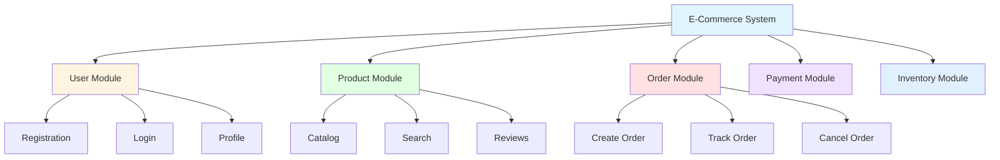

# Software Design Principles

## Learning Objectives
- Understand fundamental software design principles
- Learn about modularity and its benefits
- Master abstraction, information hiding, and refinement
- Apply design principles to create independent modules

---

## 2.1 Basic Design Principles

### What is Software Design?

**DEF** Software design is the process of transforming requirements into a blueprint for constructing the software. It defines architecture, components, interfaces, and data structures.

### Key Design Principles

**★ EXAM** Five fundamental principles guide good software design:

| Principle | Description | Benefit | Example |
|-----------|-------------|---------|---------|
| **Abstraction** | Focus on essential features, hide details | Manages complexity | Function interface without implementation |
| **Modularity** | Divide system into separate modules | Parallel development, easier maintenance | Separate login, payment, inventory modules |
| **Information Hiding** | Conceal internal details from other modules | Reduces dependencies, improves security | Private variables in OOP |
| **Separation of Concerns** | Divide system into distinct features | Easier to understand and modify | UI logic separate from business logic |
| **Refinement** | Progressive elaboration of details | Step-by-step development | High-level design → detailed design |

---

## Abstraction

**DEF** Abstraction is the process of hiding complex implementation details and showing only the essential features of an object or system.

### Types of Abstraction

| Type | Description | Example |
|------|-------------|---------|
| **Procedural Abstraction** | Named sequence of instructions | `calculateSalary()` function |
| **Data Abstraction** | Named collection of data | `Student` class with attributes |
| **Control Abstraction** | Encapsulate control mechanisms | `for` loop, `if-else` statements |
| **Object Abstraction** | Combine data and procedures | Class with methods and attributes |

### Example: Abstraction in Real Life

```
CAR ABSTRACTION
===============
What you see (Interface):
- Steering wheel
- Accelerator pedal
- Brake pedal
- Gear shift

What's hidden (Implementation):
- Engine combustion process
- Transmission mechanics
- Electrical wiring
- Fuel injection system
```

### Example: Procedural Abstraction in Code

```python
# High-level abstraction - WHAT it does
def processOrder(order):
    validateOrder(order)
    calculateTotal(order)
    processPayment(order)
    generateInvoice(order)

# Low-level details are hidden in separate functions
def validateOrder(order):
    # Detailed validation logic
    pass

def calculateTotal(order):
    # Detailed calculation logic
    pass
```

---

## Modularity

**DEF** Modularity is the property of a system that has been decomposed into a set of cohesive, loosely coupled modules.

### Benefits of Modularity

| Benefit | Description |
|---------|-------------|
| **Parallel Development** | Different teams work on different modules simultaneously |
| **Easier Testing** | Test individual modules independently |
| **Maintainability** | Changes in one module don't affect others |
| **Reusability** | Modules can be reused in other projects |
| **Understandability** | Smaller modules are easier to comprehend |
| **Fault Isolation** | Bugs are contained within specific modules |

### Mermaid Diagram - Modular System



### Module Independence

**DEF** Module independence is measured by two criteria:
1. **Cohesion** (internal binding) - How well elements within a module belong together
2. **Coupling** (external dependency) - How much one module depends on another

**TIP** Goal: **High Cohesion + Low Coupling** = Highly independent modules

### Example: Modular vs Non-Modular Design

**Bad Design (Non-Modular - Monolithic):**
```python
def main_system():
    # 1000 lines of code mixing everything
    # User authentication
    # Database operations
    # Business logic
    # UI rendering
    # Report generation
    # All in one function!
```

**Good Design (Modular):**
```python
# Separate modules
def authenticate_user():
    # Only handles authentication
    pass

def process_database_query():
    # Only handles database operations
    pass

def generate_report():
    # Only handles report generation
    pass
```

---

## Information Hiding

**DEF** Information hiding is the principle of concealing internal implementation details of a module from other modules.

### What to Hide?
- Data structures
- Algorithms
- Implementation details
- Internal state

### What to Expose?
- Public interfaces
- Function signatures
- APIs

### Example: Information Hiding

```python
class BankAccount:
    # HIDDEN (Private)
    __balance = 0
    __interest_rate = 0.05
    __transaction_history = []
    
    # EXPOSED (Public interface)
    def deposit(self, amount):
        # Internal logic hidden
        if amount > 0:
            self.__balance += amount
            self.__log_transaction("Deposit", amount)
    
    def get_balance(self):
        return self.__balance  # Controlled access
    
    # Internal method hidden from outside
    def __log_transaction(self, type, amount):
        self.__transaction_history.append({
            "type": type,
            "amount": amount
        })
```

### Benefits of Information Hiding
1. **Reduces Complexity**: Users only need to understand the interface
2. **Improves Security**: Sensitive data is protected
3. **Enables Changes**: Internal implementation can change without affecting users
4. **Reduces Dependencies**: Modules depend only on interfaces, not internals

---

## Separation of Concerns

**DEF** Separation of concerns is a design principle for separating a computer program into distinct sections, each addressing a separate concern.

### Classic Example: MVC Architecture

| Layer | Concern | Responsibility | Example |
|-------|---------|----------------|---------|
| **Model** | Data and business logic | Data storage, validation, calculations | Database operations |
| **View** | User interface | Display data, collect user input | HTML pages, GUI |
| **Controller** | Application flow | Handle user input, update model/view | Request handlers |

### Example: E-Commerce System

```
SEPARATION OF CONCERNS
======================

Presentation Layer (UI):
- Product catalog display
- Shopping cart interface
- Checkout forms

Business Logic Layer:
- Price calculations
- Discount rules
- Inventory checks

Data Access Layer:
- Database queries
- Data validation
- Transaction management
```

### Benefits
- Easier to understand and maintain
- Teams can work on different layers independently
- Easier to test each concern separately
- Changes in one layer don't affect others

---

## Refinement (Stepwise Refinement)

**DEF** Refinement is a top-down design strategy where a system is progressively elaborated from high-level abstract description to detailed implementation.

### Refinement Process

```
Level 0: Solve the problem (most abstract)
    ↓
Level 1: Break into sub-problems
    ↓
Level 2: Break sub-problems into smaller tasks
    ↓
Level 3: Continue until implementable (most detailed)
```

### Example: Refinement for Library System

```
LEVEL 0 (Highest):
└─ Manage Library

LEVEL 1:
└─ Manage Library
   ├─ Manage Books
   ├─ Manage Members
   └─ Manage Transactions

LEVEL 2:
└─ Manage Books
   ├─ Add Book
   ├─ Remove Book
   ├─ Search Book
   └─ Update Book Info

LEVEL 3 (Most Detailed):
└─ Add Book
   ├─ Validate ISBN
   ├─ Check for duplicates
   ├─ Assign book ID
   ├─ Store in database
   └─ Generate confirmation
```

---

## Design Principles Summary

### The Golden Rule

```
GOOD SOFTWARE DESIGN = 
    High Cohesion (modules do one thing well)
    +
    Low Coupling (modules are independent)
    +
    Information Hiding (implementation details concealed)
    +
    Abstraction (complexity managed)
    +
    Modularity (system divided into manageable parts)
```

### Design Checklist

```
✓ Is the system modular?
✓ Does each module have high cohesion?
✓ Are modules loosely coupled?
✓ Is internal implementation hidden?
✓ Are appropriate abstractions used?
✓ Is there clear separation of concerns?
✓ Has stepwise refinement been applied?
```

---

## Practice Questions

### MCQs

**Q1. Which design principle focuses on hiding internal details?**  
a) Modularity  
b) Information Hiding  
c) Abstraction  
d) Refinement  
**Answer: b) Information Hiding**

**Q2. The goal of good software design is:**  
a) High coupling, low cohesion  
b) Low coupling, high cohesion  
c) High coupling, high cohesion  
d) Low coupling, low cohesion  
**Answer: b) Low coupling, high cohesion**

**Q3. Stepwise refinement is which type of design strategy?**  
a) Bottom-up  
b) Top-down  
c) Horizontal  
d) Diagonal  
**Answer: b) Top-down**

**Q4. MVC architecture is an example of:**  
a) Information hiding  
b) Separation of concerns  
c) Abstraction only  
d) Coupling  
**Answer: b) Separation of concerns**

**Q5. Which is NOT a benefit of modularity?**  
a) Parallel development  
b) Easier testing  
c) Increased coupling  
d) Reusability  
**Answer: c) Increased coupling**

---

### Short Answer Questions

**Q1. Explain the benefits of modularity in software design.**  
**Answer:**
Modularity provides multiple benefits:
1. **Parallel Development**: Different teams can work on different modules simultaneously
2. **Easier Testing**: Individual modules can be tested independently (unit testing)
3. **Maintainability**: Changes in one module have minimal impact on others
4. **Reusability**: Well-designed modules can be reused in other projects
5. **Understandability**: Smaller modules are easier to comprehend than monolithic code
6. **Fault Isolation**: Bugs are contained within specific modules, easier to debug

**Q2. Differentiate between abstraction and information hiding.**  
**Answer:**

| Abstraction | Information Hiding |
|-------------|-------------------|
| Shows essential features | Conceals implementation details |
| Focus on WHAT it does | Hide HOW it does it |
| Reduces complexity | Protects internal state |
| Example: Function interface | Example: Private variables |
| Makes system understandable | Makes system secure and flexible |

**Q3. What is stepwise refinement? Give an example.**  
**Answer:**
Stepwise refinement is a top-down design strategy where a system is progressively elaborated from high-level abstract description to detailed implementation.

**Example**: Library Management System
- Level 0: Manage Library
- Level 1: Manage Books, Manage Members, Manage Transactions
- Level 2 (for Books): Add Book, Remove Book, Search Book, Update Book
- Level 3 (for Add Book): Validate ISBN, Check duplicates, Assign ID, Store in DB

Each level adds more detail until the design is implementable.

---

## Exam Tips

1. **Remember the 5 principles**: Abstraction, Modularity, Information Hiding, Separation of Concerns, Refinement
2. **High Cohesion + Low Coupling**: This is the golden rule - memorize it
3. **Give examples**: Always support principles with code or real-world examples
4. **Draw diagrams**: Module decomposition diagrams score well
5. **MVC example**: Use MVC when explaining separation of concerns
6. **Comparison tables**: Use for abstraction vs information hiding

---

## Textbook References
- Rajib Mall: Chapter 5 (Software Design)
- Pressman: Chapter 8 (Design Concepts)

---

**Next Topic**: [Cohesion and Coupling](02_Cohesion_and_Coupling.md)
