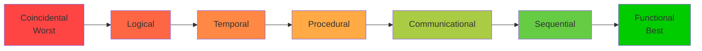
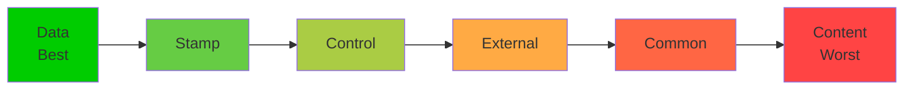

# Cohesion and Coupling - Complete Guide

## 📚 Learning Objectives
- Understand the concepts of cohesion and coupling
- Identify different types of cohesion and coupling
- Design modules with high cohesion and low coupling
- Measure and improve module independence

---

## 1. Introduction

**Module Independence** is the key objective of good software design. It is measured by two criteria:
1. **Cohesion** (internal strength) - How closely related elements are within a module
2. **Coupling** (interconnection) - How interconnected modules are with each other

### Golden Rule of Software Design:
```
┌─────────────────────────────────────┐
│  HIGH Cohesion + LOW Coupling =     │
│  BEST Module Independence           │
└─────────────────────────────────────┘
```

### Why Module Independence?
- Easier to understand
- Easier to modify
- Easier to test
- Easier to maintain
- Better reusability
- Parallel development possible

---

## 2. Cohesion - Internal Strength of a Module

**Cohesion** measures how closely related the elements within a single module are. **High cohesion is GOOD.**

### Types of Cohesion (Worst to Best):

### Mermaid Diagram - Cohesion Spectrum:


---

### 2.1 Coincidental Cohesion (Worst) ❌

**Definition**: Elements are grouped together with **no meaningful relationship**. Just arbitrary grouping.

**Characteristics**:
- Lowest cohesion
- Elements are unrelated
- Difficult to understand, test, and maintain

**Example**:
```python
# Utility module - random functions grouped together
def calculate_tax():
    pass

def print_invoice():
    pass

def send_email():
    pass

def resize_image():
    pass
# These functions have nothing to do with each other!
```

**Real-World Analogy**: Putting a book, a shoe, and a banana in the same box just because you have space.

**Exam Identification**: "miscellaneous", "utility", "helper" modules with unrelated functions.

---

### 2.2 Logical Cohesion

**Definition**: Elements are grouped because they are **logically similar in category**, but perform different functions.

**Characteristics**:
- Low cohesion
- Functions belong to same category but do different things
- Control flag determines which function executes

**Example**:
```python
# All input operations grouped together
def handle_input(input_type):
    if input_type == "keyboard":
        read_keyboard()
    elif input_type == "mouse":
        read_mouse()
    elif input_type == "scanner":
        read_scanner()
    elif input_type == "microphone":
        read_microphone()
# All are input operations, but completely different implementations
```

**Real-World Analogy**: All "emergency tools" in one box - fire extinguisher, first aid kit, flashlight (all for emergencies, but different purposes).

---

### 2.3 Temporal Cohesion

**Definition**: Elements are grouped because they **execute at the same time** (same time period).

**Characteristics**:
- Low to moderate cohesion
- Functions related by timing, not by functionality
- Common in initialization or cleanup code

**Example**:
```python
# Initialization module
def system_startup():
    initialize_database()
    load_configuration()
    setup_user_interface()
    connect_to_network()
    start_background_services()
# All execute at startup, but serve different purposes
```

**Real-World Analogy**: Morning routine - brush teeth, make coffee, check email (all done in morning, but unrelated activities).

**Common Examples**:
- System initialization
- System cleanup/shutdown
- Error handling routines

---

### 2.4 Procedural Cohesion

**Definition**: Elements are grouped because they **execute in a specific sequence** (one after another).

**Characteristics**:
- Moderate cohesion
- Functions are related by order of execution
- Each function completes before next begins

**Example**:
```python
# File processing sequence
def process_file(filename):
    open_file(filename)        # Step 1
    validate_format()          # Step 2
    parse_content()            # Step 3
    transform_data()           # Step 4
    save_results()             # Step 5
# Each step must happen in this specific order
```

**Real-World Analogy**: Recipe steps - mix ingredients, bake, cool, decorate (must be done in sequence, but different activities).

---

### 2.5 Communicational Cohesion

**Definition**: Elements are grouped because they **operate on the same data** or contribute to the same output.

**Characteristics**:
- Good cohesion
- Functions work on same data structure
- Functions contribute to same output

**Example**:
```python
# Student record module - all functions work on student data
def update_student_grade(student_id, grade):
    # Updates student database
    pass

def calculate_student_gpa(student_id):
    # Reads student grades from database
    pass

def generate_student_report(student_id):
    # Reads student data and creates report
    pass
# All functions work with the same student record
```

**Real-World Analogy**: All functions in a bank teller system work on the same customer account.

---

### 2.6 Sequential Cohesion

**Definition**: Elements are grouped because **output of one element is input to the next** (data flows between them).

**Characteristics**:
- High cohesion
- Functions form a pipeline
- Output of one function is input to next

**Example**:
```python
# Order processing pipeline
def get_order_details(order_id):
    return order_data  # Output: order data

def validate_order(order_data):
    return is_valid  # Input: order data, Output: validation result

def calculate_total(order_data, is_valid):
    return total_amount  # Input: order data, Output: total

def generate_invoice(order_data, total_amount):
    return invoice  # Input: order data & total, Output: invoice
# Each function's output feeds into the next
```

**Real-World Analogy**: Assembly line - each station's output is next station's input.

---

### 2.7 Functional Cohesion (Best) ✅

**Definition**: Module performs **one and only one well-defined task**. All elements are essential to that single function.

**Characteristics**:
- **Highest cohesion** (ideal)
- Single, clear purpose
- All elements contribute to one function
- Easy to understand, test, and maintain

**Examples**:
```python
# Each module does ONE thing perfectly

def calculate_square_root(number):
    """Calculates square root using Newton's method"""
    # Only does this one task
    pass

def validate_email(email):
    """Validates email format"""
    # Only validates email
    pass

def sort_array(arr):
    """Sorts array using quicksort"""
    # Only sorts
    pass
```

**Real-World Analogy**: A calculator's square root button - does exactly one thing.

**Benefits**:
- Maximum reusability
- Easy to test
- Easy to understand
- Easy to maintain
- Minimal side effects

---

### Cohesion Comparison Table:

| Type | Relationship | Cohesion Level | Difficulty to Maintain |
|------|--------------|----------------|------------------------|
| Coincidental | None | Worst | Very Hard |
| Logical | Category | Low | Hard |
| Temporal | Time | Low-Moderate | Hard |
| Procedural | Sequence | Moderate | Moderate |
| Communicational | Data | Good | Easy |
| Sequential | Data Flow | High | Very Easy |
| **Functional** | **Single Task** | **Best** | **Easiest** |

---

## 3. Coupling - Interconnection Between Modules

**Coupling** measures how much one module depends on another module. **Low coupling is GOOD.**

### Types of Coupling (Best to Worst):

### Mermaid Diagram - Coupling Spectrum:


---

### 3.1 Data Coupling (Best) ✅

**Definition**: Modules communicate by **passing simple data parameters** (primitive data types).

**Characteristics**:
- **Lowest coupling** (ideal)
- Only necessary data is passed
- Modules are independent
- Easy to modify and test

**Example**:
```python
def calculate_area(length, width):
    return length * width

def main():
    l = 10
    w = 5
    area = calculate_area(l, w)  # Passing simple data
# Only data needed is passed, nothing else
```

**Why it's good**: Modules know nothing about each other's internals.

---

### 3.2 Stamp Coupling (Data Structure Coupling)

**Definition**: Modules communicate by **passing complete data structures**, but only use part of the data.

**Characteristics**:
- Low to moderate coupling
- More data passed than needed
- Receiving module knows structure of data

**Example**:
```python
def process_student(student_record):
    # Receives entire student record
    # But only uses the name
    print(student_record.name)
    # Doesn't use: grades, address, phone, etc.

# Calling code:
student = {
    'name': 'John',
    'grades': [90, 85, 88],
    'address': '123 Main St',
    'phone': '555-1234'
}
process_student(student)  # Passing entire structure
```

**Why it's okay but not ideal**: Module receives more information than it needs.

---

### 3.3 Control Coupling

**Definition**: One module passes **control information** (flags, switches) to another module to influence its behavior.

**Characteristics**:
- Moderate coupling
- Receiving module's behavior depends on control flag
- Calling module needs to know internal logic

**Example**:
```python
def process_data(data, process_type):
    if process_type == "sort":
        return sorted(data)
    elif process_type == "reverse":
        return data[::-1]
    elif process_type == "shuffle":
        return random.shuffle(data)

# Caller must know what options are available
result = process_data(my_data, "sort")  # Passing control flag
```

**Why it's problematic**: Caller needs to know internal implementation details.

---

### 3.4 External Coupling

**Definition**: Modules share **externally imposed data format, protocol, or device interface**.

**Characteristics**:
- Moderate to high coupling
- Modules depend on external standards
- Changes in external system affect multiple modules

**Example**:
```python
# Multiple modules depend on specific file format
def read_csv_file(filename):
    # Expects specific CSV format
    pass

def write_csv_file(data, filename):
    # Must write in same format
    pass

# Both modules coupled to external CSV format specification
```

**Real Examples**:
- File formats (PDF, JPEG, CSV)
- Communication protocols (HTTP, FTP)
- Database schemas

---

### 3.5 Common Coupling (Global Data Coupling)

**Definition**: Modules share **global data** (global variables, common data area).

**Characteristics**:
- High coupling
- Any module can modify global data
- Difficult to track changes
- Side effects common

**Example**:
```python
# Global variable
current_user = None

def login(username, password):
    global current_user
    # Authenticates and sets global variable
    current_user = username

def display_dashboard():
    global current_user
    # Depends on global variable being set
    print(f"Welcome, {current_user}")

def logout():
    global current_user
    current_user = None

# All modules depend on and modify current_user
# Very difficult to test and maintain!
```

**Problems**:
- One module's change affects others unexpectedly
- Difficult to debug
- Hard to test in isolation
- Re-entrancy issues

---

### 3.6 Content Coupling (Worst) ❌

**Definition**: One module **directly accesses or modifies** the internal data or code of another module.

**Characteristics**:
- **Highest coupling** (worst)
- Complete dependency
- Violates information hiding
- Extremely difficult to maintain

**Examples**:
```python
# Example 1: Modifying another module's local data
def module_A():
    local_data = [1, 2, 3, 4, 5]
    module_B()
    # module_B modified local_data directly!

def module_B():
    # Accessing module_A's local variable (not possible in Python,
    # but possible in languages with pointers)
    pass

# Example 2: Branching into middle of another module
def process_order():
    # Step 1
    # Step 2
    goto_middle_of_calculate_tax()  # Jumping into another function!
    # Step 3

# Example 3: Sharing code by overlay (one module's code overlays another)
```

**Why it's terrible**:
- Modules are completely dependent
- Cannot change one without affecting other
- Impossible to test independently
- Violates all design principles

---

### Coupling Comparison Table:

| Type | Data Shared | Coupling Level | Maintainability |
|------|-------------|----------------|-----------------|
| **Data** | Simple parameters | **Best** | Easiest |
| Stamp | Data structures | Low | Easy |
| Control | Control flags | Moderate | Moderate |
| External | External formats | Moderate-High | Hard |
| Common | Global data | High | Harder |
| **Content** | Internal code/data | **Worst** | Hardest |

---

## 4. Design Rules for Good Modules

### Rules for High Cohesion:
1. ✅ Each module should have **single, clear purpose**
2. ✅ All elements in module should **contribute to that purpose**
3. ✅ Avoid "utility" or "helper" modules with unrelated functions
4. ✅ If you can't describe module's purpose in one sentence, split it
5. ✅ Group related functions that work on same data

### Rules for Low Coupling:
1. ✅ Pass only **necessary data** between modules
2. ✅ Avoid **global variables**
3. ✅ Don't pass **control flags** (use separate functions instead)
4. ✅ Don't access **internal data** of other modules
5. ✅ Use **interfaces** or **APIs** for communication
6. ✅ Minimize the **number of connections** between modules

---

## 5. Measuring Module Independence

### Qualitative Measures:
- Can you understand the module in isolation?
- Can you test the module independently?
- Can you modify the module without affecting others?
- Can you reuse the module in another system?

### Quantitative Measures (Advanced):
- **Cohesion Metrics**: LCOM (Lack of Cohesion in Methods)
- **Coupling Metrics**: Number of dependencies, fan-in, fan-out
- **Complexity Metrics**: Cyclomatic complexity

---

## 6. Real-World Examples

### Bad Design (Low Cohesion, High Coupling):
```python
# God class - does everything
class SystemManager:
    def connect_database(self):
        pass
    
    def validate_user(self):
        pass
    
    def calculate_tax(self):
        pass
    
    def send_email(self):
        pass
    
    def generate_report(self):
        pass
    
    def backup_database(self):
        pass
# Coincidental cohesion - unrelated functions!
```

### Good Design (High Cohesion, Low Coupling):
```python
# Separate modules, each with single responsibility
class DatabaseConnector:
    def connect(self):
        pass
    def disconnect(self):
        pass

class UserManager:
    def validate_user(self):
        pass
    def create_user(self):
        pass

class TaxCalculator:
    def calculate_income_tax(self):
        pass
    def calculate_sales_tax(self):
        pass

class EmailService:
    def send_email(self):
        pass

class ReportGenerator:
    def generate_pdf_report(self):
        pass

# Each module: Functional cohesion, Data coupling
```

---

## 📝 Practice Questions

### MCQs:

**Q1. Which is the best type of cohesion?**  
a) Logical  
b) Sequential  
c) Functional  
d) Communicational  
**Answer: c) Functional**

**Q2. Which is the worst type of coupling?**  
a) Common  
b) Content  
c) Control  
d) Stamp  
**Answer: b) Content**

**Q3. Modules that execute at the same time exhibit:**  
a) Procedural cohesion  
b) Temporal cohesion  
c) Logical cohesion  
d) Sequential cohesion  
**Answer: b) Temporal cohesion**

**Q4. Passing a complete student record when only name is needed is:**  
a) Data coupling  
b) Stamp coupling  
c) Control coupling  
d) Common coupling  
**Answer: b) Stamp coupling**

**Q5. Global variables cause which type of coupling?**  
a) External coupling  
b) Common coupling  
c) Content coupling  
d) Control coupling  
**Answer: b) Common coupling**

**Q6. Output of one module is input to next module. This is:**  
a) Communicational cohesion  
b) Procedural cohesion  
c) Sequential cohesion  
d) Functional cohesion  
**Answer: c) Sequential cohesion**

**Q7. Which design principle is ideal?**  
a) Low cohesion, low coupling  
b) High cohesion, high coupling  
c) High cohesion, low coupling  
d) Low cohesion, high coupling  
**Answer: c) High cohesion, low coupling**

---

### Short Answer Questions:

**Q1. Explain all types of cohesion with examples.**  
**Answer:** (Write all 7 types from worst to best with examples as explained above)

**Q2. Differentiate between stamp coupling and control coupling.**  
**Answer:**

| Stamp Coupling | Control Coupling |
|----------------|------------------|
| Modules share data structures | Modules share control flags |
| Receives more data than needed | Behavior depends on flag value |
| Knows structure of data | Knows internal logic |
| Example: Passing entire record | Example: Pass "sort" or "reverse" flag |

**Q3. Why is content coupling considered the worst?**  
**Answer:**
- One module directly accesses another's internals
- Violates information hiding principle
- Cannot modify one module without affecting other
- Impossible to test independently
- Creates hidden dependencies
- Leads to unpredictable behavior
- Makes maintenance extremely difficult

**Q4. How can you improve a module with coincidental cohesion?**  
**Answer:**
1. Identify unrelated functions in the module
2. Group related functions together
3. Create separate modules for each functional area
4. Ensure each module has a single, clear purpose
5. Establish proper interfaces between new modules
6. Test each module independently

---

## 🔥 Exam Tips

1. **Remember the order** of cohesion types (worst to best) and coupling types (best to worst)
2. **Give examples** for each type (even if not explicitly asked)
3. **Draw diagrams** showing the spectrum
4. **Use the phrase**: "High cohesion and low coupling is the goal"
5. **Relate to real-world** analogies for better marks
6. **Identify types** from code snippets (common exam question)
7. **Explain WHY** functional cohesion is best and content coupling is worst

---

## 📖 Textbook References
- Rajib Mall: Chapter 5 (Software Design)
- Pressman: Chapter 8 (Design Concepts)

---

**Previous Topic**: [Design Principles](01_Design_Principles.md)  
**Next Topic**: [DFD and Structured Analysis](03_DFD_and_Structured_Analysis.md)
