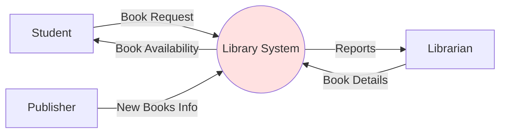
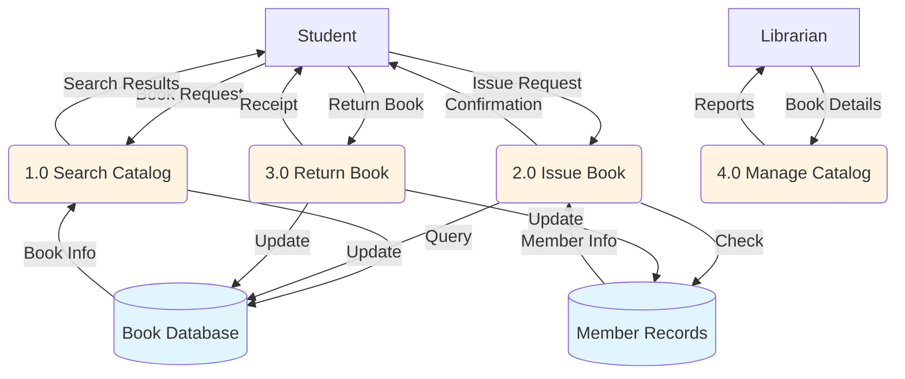
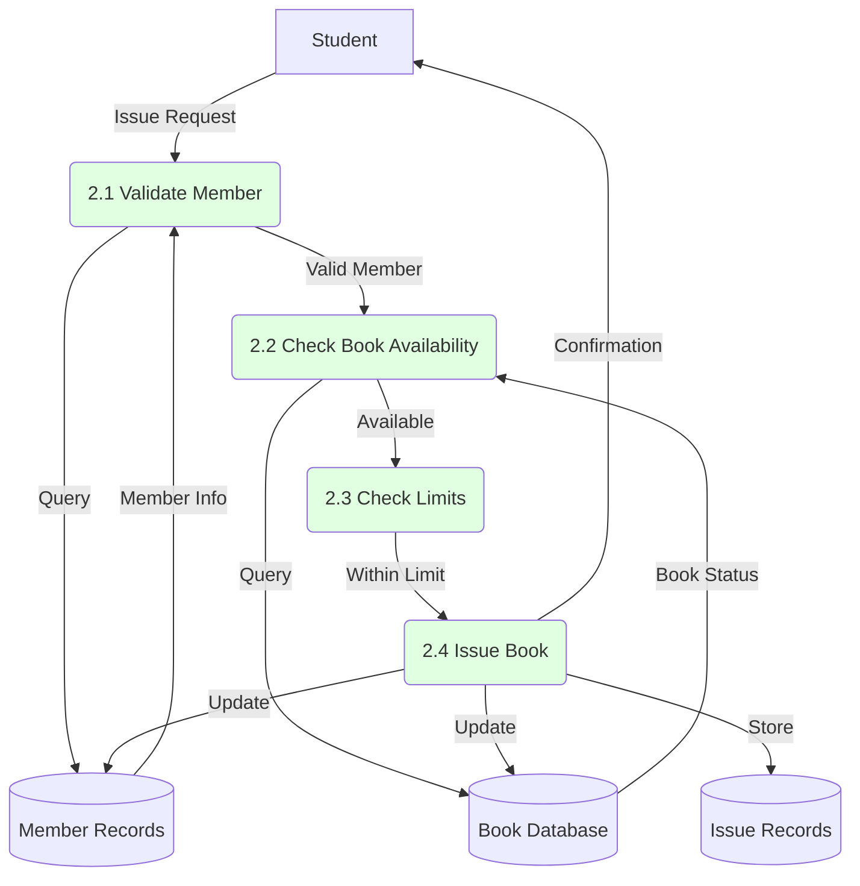

# Data Flow Diagrams (DFD) and Structured Analysis

## Learning Objectives
- Understand DFD symbols and their meanings
- Create Level 0, 1, and 2 DFDs
- Apply DFD rules and conventions
- Use structured analysis for system modeling

---

## 2.4 Data Flow Diagrams (DFD)

### What is a DFD?

**DEF** A Data Flow Diagram (DFD) is a graphical representation of how data flows through a system. It shows processes, data stores, data flows, and external entities without showing control flow or timing.

### Purpose of DFD
- Visualize system requirements
- Show data movement and transformation
- Communicate with stakeholders
- Identify data stores and processes
- Foundation for structured design

---

## DFD Symbols

**★ EXAM** Memorize these four symbols:

| Symbol | Shape | Represents | Example |
|--------|-------|------------|---------|
| **External Entity** | Rectangle/Square | Source or destination of data (outside system) | Customer, Bank, Admin |
| **Process** | Circle/Rounded rectangle | Transforms input data to output | Calculate Total, Validate Login |
| **Data Store** | Open rectangle (parallel lines) | Repository where data is stored | Database, File, Customer Records |
| **Data Flow** | Arrow | Movement of data between components | Order details, Payment info |

### Symbol Details

**External Entity:**
- Also called: Terminator, Source/Sink
- Represents: People, organizations, external systems
- Does NOT process data
- Example: Customer, Supplier, Government Agency

**Process:**
- Also called: Bubble, Function, Transformation
- Must have at least one input and one output
- Transforms data (doesn't just pass it through)
- Labeled with verb phrase: "Calculate Tax", "Validate User"

**Data Store:**
- Also called: File, Database
- Passive - data doesn't move by itself
- Must be connected to a process (not directly to entities or other stores)
- Labeled with noun phrase: "Customer Data", "Orders"

**Data Flow:**
- Shows direction of data movement
- Labeled with data name: "Invoice", "Query"
- Can be bidirectional (two arrows or double-headed arrow)

---

## DFD Levels

### Level 0 DFD (Context Diagram)

**DEF** The Context Diagram is the highest level of abstraction. It shows the entire system as a single process with all external entities and data flows.

### Characteristics:
- Single process representing the whole system
- All external entities shown
- Major data flows in and out
- No data stores shown
- System boundary clearly defined

### Example: Library Management System - Context Diagram



**Explanation:**
- Single process: Library System
- External entities: Student, Librarian, Publisher
- Data flows shown between entities and system
- No internal details visible

---

### Level 1 DFD

**DEF** Level 1 DFD decomposes the Level 0 process into major sub-processes (typically 3-9 processes) and shows data stores.

### Characteristics:
- Breaks down single process into major functions
- Shows data stores
- Shows data flows between processes
- More detailed than Level 0

### Example: Library Management System - Level 1 DFD



**Processes Identified:**
1.0 Search Catalog  
2.0 Issue Book  
3.0 Return Book  
4.0 Manage Catalog  

**Data Stores:**
- Book Database
- Member Records

---

### Level 2 DFD

**DEF** Level 2 DFD further decomposes a Level 1 process into more detailed sub-processes.

### Example: Level 2 DFD for "2.0 Issue Book"



**Sub-processes:**
2.1 Validate Member  
2.2 Check Book Availability  
2.3 Check Limits (max books allowed)  
2.4 Issue Book  

---

## DFD Rules (Important!)

**★ EXAM** These rules are frequently tested:

### ✅ Valid DFD Rules

| Rule | Description | Reason |
|------|-------------|--------|
| **Process must transform data** | Output must differ from input | A process that just passes data is not transforming |
| **Data flow must connect to process** | At least one end must be a process | Data doesn't move by itself |
| **Data stores connect only to processes** | Not to entities or other stores | Processes read/write data |
| **External entities don't connect to each other** | Must go through system | Otherwise, it's outside system scope |
| **Each process has unique ID** | Numbered hierarchically | For traceability |
| **Data flow is labeled** | Named with data description | Clarity |

### ❌ Invalid DFD Patterns

| Invalid Pattern | Why It's Wrong | Correction |
|-----------------|----------------|------------|
| Entity → Entity | Bypasses system | Route through process |
| Entity → Data Store | No processing | Add process between |
| Data Store → Data Store | No transformation | Add process |
| Process with no input | Creating data from nothing | Add input flow |
| Process with no output | Data black hole | Add output flow |
| Data store → Entity | No processing | Add process |

---

## DFD Examples

### Example 1: Online Shopping System

**Context Diagram (Level 0):**
```
External Entities: Customer, Payment Gateway, Admin

Processes: Shopping System (single process)

Data Flows:
- Customer → System: Order Details
- System → Customer: Order Confirmation
- System → Payment Gateway: Payment Request
- Payment Gateway → System: Payment Status
- Admin → System: Product Updates
- System → Admin: Sales Reports
```

### Example 2: ATM System

**Level 1 DFD Processes:**
```
1.0 Authenticate User
2.0 Check Balance
3.0 Withdraw Cash
4.0 Deposit Cash
5.0 Transfer Funds
6.0 Print Receipt

Data Stores:
- Account Database
- Transaction Log
- Card Database
```

---

## Structured Analysis

**DEF** Structured Analysis is a software engineering technique that uses DFDs to model system requirements in a structured, hierarchical manner.

### Structured Analysis Components

| Component | Purpose | Tool |
|-----------|---------|------|
| **Data Flow Diagrams** | Show data movement | DFD (Level 0, 1, 2) |
| **Data Dictionary** | Define all data elements | Detailed data descriptions |
| **Process Specifications** | Describe process logic | Structured English, Decision Tables |
| **Entity-Relationship Diagram** | Show data relationships | ER Diagram |

### Data Dictionary

**DEF** A data dictionary is a centralized repository of information about data such as meaning, relationships to other data, origin, usage, and format.

**Example Entry:**
```
Data Element: Customer_ID
Type: Alphanumeric
Length: 10 characters
Format: CUS-XXXXX
Description: Unique identifier for each customer
Validation: Must start with "CUS-" followed by 5 digits
```

### Process Specification Example

**Process:** 2.0 Issue Book

```
PROCESS SPECIFICATION
=====================
Process ID: 2.0
Process Name: Issue Book
Input: Book request, Member ID
Output: Issue confirmation or rejection

Logic:
1. Validate member status (active/suspended)
2. Check if book is available
3. Verify member hasn't exceeded limit (max 5 books)
4. Check for overdue books
5. If all checks pass:
   - Record issue transaction
   - Update book status to "issued"
   - Update member record
   - Generate receipt
6. Else:
   - Generate rejection message with reason
```

---

## DFD vs Flowchart

| Aspect | DFD | Flowchart |
|--------|-----|-----------|
| **Focus** | Data flow | Control flow |
| **Shows** | What data moves where | Sequence of operations |
| **Timing** | No timing information | Shows execution order |
| **Loops** | Cannot show loops | Can show loops |
| **Decisions** | Cannot show decisions | Can show decisions |
| **Use** | Requirements analysis | Implementation design |

---

## Practice Questions

### MCQs

**Q1. In DFD, a rectangle represents:**  
a) Process  
b) Data Store  
c) External Entity  
d) Data Flow  
**Answer: c) External Entity**

**Q2. Which level of DFD shows the system as a single process?**  
a) Level 1  
b) Level 2  
c) Level 0 (Context Diagram)  
d) Level 3  
**Answer: c) Level 0 (Context Diagram)**

**Q3. Which is NOT a valid DFD connection?**  
a) Process → Data Store  
b) External Entity → Process  
c) Data Store → Data Store  
d) Process → External Entity  
**Answer: c) Data Store → Data Store**

**Q4. A process in DFD must have:**  
a) Only input  
b) Only output  
c) At least one input and one output  
d) No inputs or outputs  
**Answer: c) At least one input and one output**

**Q5. Data flows are represented by:**  
a) Rectangles  
b) Circles  
c) Arrows  
d) Parallel lines  
**Answer: c) Arrows**

---

### Short Answer Questions

**Q1. Draw Level 0 and Level 1 DFD for a Library Management System.**  
**Answer:**

**Level 0 (Context Diagram):**
- Single process: Library Management System
- External entities: Student, Librarian
- Data flows:
  - Student → System: Book Request, Return Request
  - System → Student: Book, Confirmation
  - Librarian → System: Book Details, Member Info
  - System → Librarian: Reports, Alerts

**Level 1 DFD:**
- Processes: 1.0 Search Catalog, 2.0 Issue Book, 3.0 Return Book, 4.0 Manage Catalog
- Data Stores: Book Database, Member Records, Issue Records
- Data flows between processes, entities, and data stores as shown in examples above

**Q2. List and explain DFD rules.**  
**Answer:**
1. **Process must transform data**: Output must differ from input
2. **Data flow must connect to process**: At least one end must be a process
3. **Data stores connect only to processes**: Not directly to entities or other stores
4. **External entities don't connect to each other**: Must go through the system
5. **Each process has unique ID**: Numbered hierarchically for traceability
6. **Data flow is labeled**: Named with data description for clarity
7. **No black holes**: Process must have output
8. **No miracles**: Process must have input

**Q3. What is structured analysis? What are its components?**  
**Answer:**
Structured Analysis is a technique that uses DFDs to model system requirements hierarchically.

**Components:**
1. **Data Flow Diagrams**: Show data movement (Level 0, 1, 2)
2. **Data Dictionary**: Define all data elements, formats, and validation rules
3. **Process Specifications**: Describe process logic using structured English or decision tables
4. **Entity-Relationship Diagrams**: Show relationships between data entities

---

## Exam Tips

1. **Memorize DFD symbols**: Draw them correctly in exams
2. **Practice drawing DFDs**: Library, ATM, Shopping systems are common
3. **Remember DFD rules**: Especially invalid patterns
4. **Level 0 = Context Diagram**: Single process, all entities
5. **Hierarchical numbering**: 1.0, 1.1, 1.2, etc.
6. **Label everything**: Processes, data flows, data stores
7. **No control flow**: DFDs show data movement, not sequence

---

## Textbook References
- Rajib Mall: Chapter 5 (Structured Analysis)
- Pressman: Chapter 9 (Modeling Requirements)

---

**Previous Topic**: [Cohesion and Coupling](02_Cohesion_and_Coupling.md)  
**Next Topic**: [Structure Charts](04_Structure_Charts.md)
