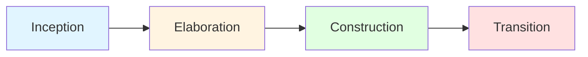

# Unified Process (UP)

## Learning Objectives
- Understand the Unified Process framework
- Learn the four phases: Inception, Elaboration, Construction, Transition
- Apply UP workflows to software projects
- Compare UP with other development models

---

## 3.1 Unified Process (UP)

### What is Unified Process?

**DEF** The Unified Process (UP) is an iterative and incremental software development framework. It is **use-case driven**, **architecture-centric**, and **iterative and incremental** in nature.

### Key Characteristics

| Characteristic | Description | Example |
|----------------|-------------|---------|
| **Use-Case Driven** | Requirements captured as use cases | "User logs in", "Customer places order" |
| **Architecture-Centric** | Focus on building robust architecture early | Define system structure before full implementation |
| **Iterative** | Repeated cycles of development | Each iteration produces working software |
| **Incremental** | System built piece by piece | Add features incrementally |

---

## UP Phases

**★ EXAM** The Unified Process has four distinct phases:

### Phase Overview Table

| Phase | Goal | Duration | Key Artifact | Exit Criteria |
|-------|------|----------|--------------|---------------|
| **Inception** | Feasibility, scope, business case | 10-20% of project | Vision document | Stakeholder agreement |
| **Elaboration** | Architecture, risk mitigation | 20-30% of project | Architecture baseline | Architecture validated |
| **Construction** | Build product iteratively | 50-60% of project | Software increment | All features implemented |
| **Transition** | Deploy to users, training | 10-15% of project | Released product | User acceptance |

---

### 1. Inception Phase

**Goal:** Establish project scope, feasibility, and business case.

### Key Activities
- Define project vision and scope
- Identify critical use cases (10-20%)
- Estimate cost and schedule
- Identify major risks
- Create business case

### Deliverables
- **Vision Document**: Project objectives and scope
- **Initial Use Case Model**: Key functionalities
- **Business Case**: Cost-benefit analysis
- **Initial Risk Assessment**: Major risks identified
- **Prototype (optional)**: Proof of concept

### Example: E-Commerce System - Inception
```
Vision: Build online store to sell books
Scope: Product catalog, shopping cart, payment processing
Business Case: Increase sales by 40%, reach wider audience
Risks: Payment security, scalability during peak seasons
Estimate: 6 months, $100,000, team of 5
```

### Exit Criteria
- Stakeholders agree on scope and requirements
- Cost and schedule estimates are acceptable
- Major risks are identified
- Business case is approved

---

### 2. Elaboration Phase

**Goal:** Establish architectural baseline and mitigate risks.

### Key Activities
- Develop 80% of use cases in detail
- Design system architecture
- Address high-risk elements
- Create executable architecture prototype
- Refine project plan

### Deliverables
- **Architecture Baseline**: System structure and design
- **Detailed Use Cases**: Most requirements specified
- **Risk Mitigation Plan**: High risks addressed
- **Executable Prototype**: Architecture validated
- **Updated Project Plan**: More accurate estimates

### Example: E-Commerce System - Elaboration
```
Architecture: Microservices with REST APIs
Technology Stack: React (frontend), Node.js (backend), MongoDB (database)
High-Risk Areas: Payment gateway integration, scalability
Prototype: Working cart and checkout with test payment
Use Cases: 80% detailed (user registration, product search, checkout)
```

### Exit Criteria
- Architecture is stable and validated
- High-risk issues are resolved
- Use cases are detailed enough for construction
- Project plan is realistic

---

### 3. Construction Phase

**Goal:** Build the complete product through iterations.

### Key Activities
- Implement all remaining use cases
- Develop all features incrementally
- Continuous testing and integration
- User feedback incorporation
- Performance optimization

### Deliverables
- **Software Increments**: Working features after each iteration
- **Test Results**: Unit, integration, system tests
- **User Manual**: Documentation for end users
- **Complete Source Code**: Fully implemented system

### Iteration Example: E-Commerce System
```
Iteration 1: User registration and login
Iteration 2: Product catalog and search
Iteration 3: Shopping cart functionality
Iteration 4: Payment processing
Iteration 5: Order tracking
Iteration 6: Admin dashboard
Iteration 7: Reporting and analytics
```

### Exit Criteria
- All features are implemented
- System passes all tests
- Performance meets requirements
- User documentation is complete

---

### 4. Transition Phase

**Goal:** Deploy system to users and ensure smooth adoption.

### Key Activities
- Beta testing with real users
- User training and support
- Data migration from old system
- Bug fixes based on user feedback
- Performance tuning in production

### Deliverables
- **Released Product**: Production-ready system
- **Training Materials**: User guides, tutorials
- **Deployment Plan**: Installation procedures
- **Support Plan**: Help desk, maintenance procedures

### Example: E-Commerce System - Transition
```
Beta Testing: 100 users test for 2 weeks
Training: Video tutorials for customers, workshop for staff
Data Migration: Import product catalog from legacy system
Bug Fixes: Address issues found during beta testing
Launch: Go-live with marketing campaign
```

### Exit Criteria
- Users are satisfied with the system
- System is stable in production
- Support infrastructure is in place
- Project objectives are met

---

## UP Workflows (Disciplines)

**DEF** Workflows are activities that occur across all phases but with different emphasis in each phase.

### Core Workflows

| Workflow | Description | Primary Phase |
|----------|-------------|---------------|
| **Requirements** | Elicit and document requirements | Elaboration |
| **Analysis** | Understand problem domain | Elaboration |
| **Design** | Create solution architecture | Elaboration/Construction |
| **Implementation** | Write code | Construction |
| **Testing** | Verify and validate | Construction/Transition |
| **Deployment** | Release to users | Transition |

### Workflow Intensity Across Phases



**Workflow Emphasis:**

| Workflow | Inception | Elaboration | Construction | Transition |
|----------|-----------|-------------|--------------|------------|
| Requirements | **High** | **Very High** | Medium | Low |
| Analysis | Medium | **Very High** | Low | Low |
| Design | Low | **Very High** | **High** | Low |
| Implementation | Low | Medium | **Very High** | Medium |
| Testing | Low | Medium | **Very High** | **High** |
| Deployment | Low | Low | Medium | **Very High** |

---

## UP vs Other Models

| Aspect | Unified Process | Waterfall | Agile |
|--------|----------------|-----------|-------|
| **Approach** | Iterative + Incremental | Linear | Iterative |
| **Phases** | 4 distinct phases | 6-7 phases | Sprints |
| **Documentation** | Moderate | Heavy | Light |
| **Architecture** | Early focus | Middle phase | Emergent |
| **Risk Handling** | Elaboration phase | Late | Each sprint |
| **Best For** | Medium-large projects | Small, clear requirements | Dynamic requirements |

---

## Benefits of Unified Process

1. **Risk Mitigation**: Addresses risks early in Elaboration
2. **Architecture Focus**: Ensures solid foundation
3. **Iterative Refinement**: Improves quality through iterations
4. **Use-Case Driven**: Aligns with user needs
5. **Predictable**: Phases provide milestones
6. **Flexible**: Adaptable to project size

## Limitations

1. **Complex**: Requires experienced team
2. **Documentation Heavy**: More than Agile
3. **Not for Small Projects**: Overhead may be excessive
4. **Requires Discipline**: Must follow processes strictly

---

## Practice Questions

### MCQs

**Q1. The Unified Process is:**  
a) Linear and sequential  
b) Use-case driven and architecture-centric  
c) Only for small projects  
d) Documentation-free  
**Answer: b) Use-case driven and architecture-centric**

**Q2. In which UP phase is the architecture baseline created?**  
a) Inception  
b) Elaboration  
c) Construction  
d) Transition  
**Answer: b) Elaboration**

**Q3. The Construction phase typically consumes what percentage of the project?**  
a) 10-20%  
b) 20-30%  
c) 50-60%  
d) 70-80%  
**Answer: c) 50-60%**

**Q4. Which workflow has highest intensity during Transition phase?**  
a) Requirements  
b) Design  
c) Implementation  
d) Deployment  
**Answer: d) Deployment**

**Q5. The Vision Document is created in which phase?**  
a) Inception  
b) Elaboration  
c) Construction  
d) Transition  
**Answer: a) Inception**

---

### Short Answer Questions

**Q1. Explain the four phases of Unified Process with examples.**  
**Answer:**

1. **Inception**: Define scope, feasibility, business case
   - Example: Decide to build e-commerce app, estimate cost, identify risks
   - Deliverable: Vision document

2. **Elaboration**: Build architecture, mitigate risks
   - Example: Choose tech stack, design database, prototype payment system
   - Deliverable: Architecture baseline

3. **Construction**: Implement all features iteratively
   - Example: Code user login, shopping cart, checkout, order tracking
   - Deliverable: Working software

4. **Transition**: Deploy, train users, fix bugs
   - Example: Beta testing, user training, go-live
   - Deliverable: Released product

**Q2. How is UP different from Waterfall and Agile?**  
**Answer:**

| UP | Waterfall | Agile |
|----|-----------|-------|
| Iterative + Incremental | Linear sequential | Iterative only |
| Architecture focus early | Architecture in middle | Architecture emerges |
| Moderate documentation | Heavy documentation | Light documentation |
| Risk handling in Elaboration | Risk handled late | Risk handled each sprint |
| Medium-large projects | Small, stable requirements | Dynamic requirements |

**Q3. What are UP workflows? Give examples.**  
**Answer:**
Workflows are activities that occur across all phases with varying intensity:
- **Requirements**: Gather user needs (use cases) - Peak in Elaboration
- **Analysis**: Understand problem domain - Peak in Elaboration
- **Design**: Create system architecture - Peak in Elaboration/Construction
- **Implementation**: Write code - Peak in Construction
- **Testing**: Verify functionality - Peak in Construction/Transition
- **Deployment**: Release to users - Peak in Transition

---

## Exam Tips

1. **Remember 4 phases**: Inception → Elaboration → Construction → Transition
2. **Key artifacts per phase**: Vision doc, Architecture baseline, Software increment, Released product
3. **Use-case driven, architecture-centric**: Memorize these characteristics
4. **Workflow intensity**: Know which workflow peaks in which phase
5. **Give examples**: Use e-commerce, library system as running examples
6. **Comparison**: Be ready to compare UP with Waterfall and Agile

---

## Textbook References
- Rajib Mall: Chapter 7 (Object-Oriented Software Engineering)
- Pressman: Chapter 4 (Agile Development)

---

**Next Topic**: [UML Use Case Diagrams](02_UML_UseCase_Diagrams.md)
