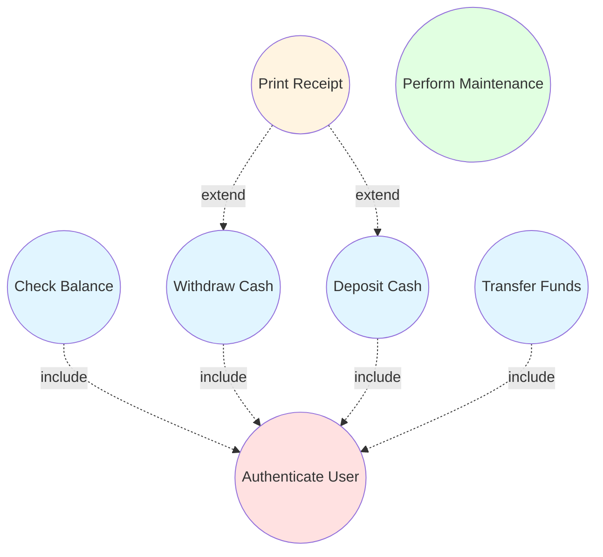

# UML Use Case Diagrams

## Learning Objectives
- Understand use case diagram elements and notation
- Model system functionality from user perspective
- Apply include, extend, and generalization relationships
- Create use case diagrams for real-world systems

---

## 3.3 Use Case Diagrams

### What is a Use Case Diagram?

**DEF** A Use Case Diagram is a behavioral UML diagram that shows the interaction between users (actors) and the system to achieve specific goals. It captures system functionality from the user's perspective.

### Purpose
- Capture functional requirements
- Show system scope and boundaries
- Identify actors and their goals
- Communicate with stakeholders
- Foundation for testing

---

## Use Case Diagram Elements

| Element | Symbol | Description | Example |
|---------|--------|-------------|---------|
| **Actor** | Stick figure | External entity interacting with system | Customer, Admin, Bank |
| **Use Case** | Oval/Ellipse | Specific functionality or goal | Login, Place Order, Search |
| **System Boundary** | Rectangle | Defines system scope | Box containing all use cases |
| **Association** | Solid line | Connection between actor and use case | Customer connects to "Place Order" |
| **Relationships** | Dashed arrows | Include, Extend, Generalization | See details below |

---

## Relationships in Use Case Diagrams

**★ EXAM** Four types of relationships:

### 1. Association

- **Symbol**: Solid line
- **Meaning**: Actor interacts with use case
- **Direction**: Can be bidirectional or unidirectional

```
[Customer] ──────── (Place Order)
```

### 2. Include Relationship

- **Symbol**: Dashed arrow with «include»
- **Meaning**: Base use case **always** includes the included use case
- **Direction**: Arrow points FROM base TO included use case
- **Purpose**: Factor out common functionality

**TIP** «include» = **Mandatory** sub-function (always executes)

```
(Place Order) - - - «include» - - -> (Validate Payment)
```

**When to Use Include:**
- Common functionality shared by multiple use cases
- Always executed as part of the base use case
- Simplifies diagram by extracting common parts

**Example:**
```
(Withdraw Cash) - - - «include» - - -> (Authenticate User)
(Deposit Money) - - - «include» - - -> (Authenticate User)
(Check Balance) - - - «include» - - -> (Authenticate User)
```

All three use cases ALWAYS require authentication.

### 3. Extend Relationship

- **Symbol**: Dashed arrow with «extend»
- **Meaning**: Extending use case **optionally** adds behavior to base use case
- **Direction**: Arrow points FROM extension TO base use case
- **Purpose**: Model optional or conditional behavior

**TIP** «extend» = **Optional** behavior (executes only under certain conditions)

```
(Apply Discount) - - - «extend» - - -> (Place Order)
        ↑
   [Only if coupon exists]
```

**When to Use Extend:**
- Optional functionality
- Conditional behavior
- Special cases that don't always occur

**Example:**
```
(Send Notification) - - - «extend» - - -> (Place Order)
        ↑
   [Only if user opted in]

(Generate Report) - - - «extend» - - -> (View Student Records)
        ↑
   [Only if admin requests]
```

### 4. Generalization

- **Symbol**: Solid line with hollow arrowhead
- **Meaning**: Inheritance relationship (child inherits from parent)
- **Direction**: Arrow points FROM child TO parent
- **Purpose**: Show specialized actors or use cases

```
[Premium Customer] ───▷ [Customer]
         ↓
   (inherits all Customer use cases + has special ones)
```

**Example with Actors:**
```
         [User]
        /      \
       ↓        ↓
[Customer]  [Admin]
```

Customer and Admin are specializations of User.

**Example with Use Cases:**
```
(Make Payment)
      ↑
     / \
    ↓   ↓
(Pay by Card)  (Pay by Cash)
```

Both are specialized forms of payment.

---

## Include vs Extend - Key Differences

**★ EXAM** This is frequently tested!

| Aspect | «include» | «extend» |
|--------|-----------|----------|
| **Execution** | Always executes | Conditionally executes |
| **Arrow Direction** | Base → Included | Extension → Base |
| **Dependency** | Base depends on included | Extension depends on base |
| **Completeness** | Base is incomplete without it | Base is complete without it |
| **Example** | Login includes Authenticate | Place Order extends with Apply Coupon |
| **Mandatory** | Yes | No |
| **Keyword** | «include» | «extend» |

### Memory Trick
- **Include** = "I **must** include this" (mandatory)
- **Extend** = "I **may** extend this" (optional)

---

## Complete Example: ATM System

### Actors
- Customer (primary)
- Bank (external system)
- Maintenance Technician

### Use Cases
- Authenticate User
- Check Balance
- Withdraw Cash
- Deposit Cash
- Transfer Funds
- Print Receipt
- Perform Maintenance

### Relationships
```
(Authenticate User) is included by:
  - Check Balance
  - Withdraw Cash
  - Deposit Cash
  - Transfer Funds

(Print Receipt) extends:
  - Withdraw Cash [if user requests]
  - Deposit Cash [if user requests]

[Bank] is involved in:
  - Authenticate User
  - Transfer Funds

[Maintenance Technician] performs:
  - Perform Maintenance
```

### Mermaid Diagram



---

## Complete Example: Library Management System

### Actors
- Student
- Librarian
- System Administrator

### Use Cases
```
Student:
- Search Books
- Reserve Book
- View Account
- Return Book

Librarian:
- Add Book
- Remove Book
- Issue Book
- Generate Reports
- Manage Members

System Administrator:
- Backup Database
- Manage User Accounts
- System Configuration

Shared (via include):
- Authenticate User (included by most use cases)

Extensions:
- Send Overdue Notification extends Issue Book
- Calculate Fine extends Return Book
```

---

## Steps to Create Use Case Diagram

1. **Identify System Boundary**: What's inside vs outside the system?
2. **Identify Actors**: Who interacts with the system?
3. **Identify Use Cases**: What are the main goals/functions?
4. **Draw Associations**: Connect actors to their use cases
5. **Identify Include Relationships**: What common functionality is always needed?
6. **Identify Extend Relationships**: What optional/conditional behavior exists?
7. **Identify Generalization**: Are there specialized actors or use cases?
8. **Review and Refine**: Check for completeness and correctness

---

## Best Practices

### DO's ✅
- Use verb phrases for use cases: "Place Order", not "Order"
- Keep use cases at same level of abstraction
- Limit to 7±2 use cases per diagram for readability
- Include system boundary rectangle
- Name actors with roles, not individuals
- Use include for mandatory, extend for optional

### DON'Ts ❌
- Don't show sequence or flow (use Activity/Sequence diagrams)
- Don't include too many use cases in one diagram
- Don't confuse include and extend
- Don't model UI details
- Don't show internal system processing

---

## Practice Questions

### MCQs

**Q1. In use case diagrams, «include» relationship indicates:**  
a) Optional behavior  
b) Mandatory sub-function  
c) Inheritance  
d) Alternative flow  
**Answer: b) Mandatory sub-function**

**Q2. The arrow in «extend» relationship points:**  
a) From base to extension  
b) From extension to base  
c) Both directions  
d) No arrow, just a line  
**Answer: b) From extension to base**

**Q3. Which symbol represents an actor in use case diagrams?**  
a) Rectangle  
b) Oval  
c) Stick figure  
d) Diamond  
**Answer: c) Stick figure**

**Q4. Generalization in use case diagrams represents:**  
a) Optional behavior  
b) Mandatory inclusion  
c) Inheritance relationship  
d) System boundary  
**Answer: c) Inheritance relationship**

**Q5. Use case diagrams are used to model:**  
a) System architecture  
b) Database schema  
c) System functionality from user perspective  
d) Code structure  
**Answer: c) System functionality from user perspective**

---

### Short Answer Questions

**Q1. Differentiate between «include» and «extend» with examples.**  
**Answer:**

| «include» | «extend» |
|-----------|----------|
| Mandatory - always executes | Optional - conditionally executes |
| Base use case incomplete without it | Base use case complete without it |
| Arrow: Base → Included | Arrow: Extension → Base |
| Example: "Place Order" includes "Validate Payment" | Example: "Place Order" extends with "Apply Coupon" |
| Factors out common functionality | Adds optional behavior |
| Used for required sub-functions | Used for special cases |

**Q2. Draw a use case diagram for Online Shopping System.**  
**Answer:**

**Actors:**
- Customer
- Admin
- Payment Gateway (external system)

**Use Cases:**
- Browse Products
- Search Products
- Add to Cart
- Place Order
- Make Payment
- Track Order
- Manage Inventory (Admin)
- Generate Reports (Admin)

**Relationships:**
- «include»: Place Order includes Make Payment
- «include»: Place Order includes Validate User
- «extend»: Apply Discount extends Place Order [if coupon exists]
- «extend»: Send Confirmation extends Place Order [always, but optional from user perspective]

**Q3. What are the benefits of use case diagrams?**  
**Answer:**
1. **User Perspective**: Captures system functionality from user's viewpoint
2. **Scope Definition**: Clearly defines system boundaries
3. **Communication**: Easy for stakeholders to understand
4. **Requirements Basis**: Foundation for detailed requirements
5. **Testing Foundation**: Use cases become test cases
6. **Simplicity**: Visual and intuitive representation
7. **Actor Identification**: Identifies all users and external systems

---

## Exam Tips

1. **Include vs Extend**: Most commonly asked - memorize differences
2. **Arrow directions**: Include (base→included), Extend (extension→base)
3. **Actor naming**: Use roles (Customer), not names (John)
4. **Use case naming**: Use verb phrases (Place Order)
5. **Draw diagrams**: Practice ATM, Library, Shopping systems
6. **System boundary**: Always draw the rectangle
7. **Memory trick**: "I MUST include" vs "I MAY extend"

---

## Textbook References
- Rajib Mall: Chapter 7 (Object-Oriented Software Engineering)
- Pressman: Chapter 9 (Modeling Requirements)

---

**Previous Topic**: [Unified Process](01_Unified_Process.md)  
**Next Topic**: [UML Class Diagrams](03_UML_Class_Diagrams.md)
