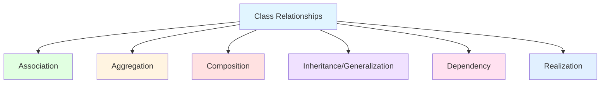

# UML Class Diagrams - Complete Guide

## 📚 Learning Objectives
- Understand class diagram components
- Identify and draw different relationships
- Use proper notation for attributes and methods
- Create complete class diagrams for real systems
- Analyze class diagram correctness

---

## 1. What is a Class Diagram?

**Class Diagram** is a static structure diagram that describes the structure of a system by showing:
- Classes
- Attributes (data)
- Methods (operations)
- Relationships between classes

**Purpose**:
- Models the static view of the system
- Used for conceptual modeling and detailed design
- Basis for coding (can generate code from class diagram)
- Most important UML diagram in software engineering

---

## 2. Class Representation

### Standard Class Notation:
```
┌─────────────────────────┐
│    ClassName            │  ← Class Name
├─────────────────────────┤
│ - attribute: Type       │  ← Attributes
│ # attribute: Type       │
│ + attribute: Type       │
├─────────────────────────┤
│ + method(): ReturnType  │  ← Methods
│ - method(param: Type)   │
│ # method(): ReturnType  │
└─────────────────────────┘
```

### Visibility Modifiers:
| Symbol | Visibility | Access |
|--------|------------|--------|
| `+` | Public | Accessible from anywhere |
| `-` | Private | Accessible only within the class |
| `#` | Protected | Accessible within class and subclasses |
| `~` | Package | Accessible within same package |

### Example Class:
```
┌────────────────────────────────────┐
│         Student                    │
├────────────────────────────────────┤
│ - studentId: String                │
│ - name: String                     │
│ - email: String                    │
│ - gpa: double                      │
├────────────────────────────────────┤
│ + getStudentId(): String           │
│ + getName(): String                │
│ + setName(name: String): void      │
│ + calculateGPA(): double           │
│ + enrollCourse(course: Course): void│
└────────────────────────────────────┘
```

---

## 3. Relationships in Class Diagrams

### Mermaid Diagram - All Relationships:


---

### 3.1 Association

**Definition**: A **structural relationship** that represents a connection between two classes. Objects of one class are connected to objects of another class.

**Notation**: Solid line
```
Student ──────── Course
```

**Characteristics**:
- "Uses-a" or "knows-a" relationship
- Both classes are independent
- Can be bidirectional or unidirectional

**Types of Association**:

#### One-to-One (1:1)
```
Student 1 ──────── 1 StudentID
```
**Example**: One student has one student ID card.

#### One-to-Many (1:*)
```
Teacher 1 ──────── * Student
```
**Example**: One teacher teaches many students.

#### Many-to-Many (*:*)
```
Student * ──────── * Course
```
**Example**: Students enroll in many courses, courses have many students.

**With Role Names**:
```
Student ────enrolls──── Course
          ────teaches──
Professor
```

**With Multiplicity**:
```
┌─────────┐         ┌─────────┐
│Student  │1     *  │Course   │
│         │─────────│         │
└─────────┘ enrolls └─────────┘
```
*Interpretation*: One student enrolls in many courses.

---

### 3.2 Aggregation (Has-A Relationship) 💎

**Definition**: A **special form of association** that represents a "whole-part" relationship where the part can exist independently of the whole.

**Notation**: Solid line with **empty diamond** at the whole end
```
Department ◇─────── Professor
   (Whole)          (Part)
```

**Characteristics**:
- "Has-a" relationship
- Part can exist without the whole
- Weak ownership
- Independent lifecycles

**Example**:
```
┌──────────────┐         ┌─────────────┐
│  Department  │1     *  │  Professor  │
│              │◇────────│             │
└──────────────┘  has    └─────────────┘
```

**Real-World Examples**:
| Whole | Part | Why Aggregation? |
|-------|------|------------------|
| Department | Professor | Professor exists even if department closes |
| Team | Player | Player can join another team |
| Library | Books | Books can be moved to another library |
| Company | Employees | Employees can work elsewhere |

**Code Example**:
```python
class Professor:
    def __init__(self, name):
        self.name = name

class Department:
    def __init__(self, name):
        self.name = name
        self.professors = []  # Professors can exist independently
    
    def add_professor(self, professor):
        self.professors.append(professor)

# Professor exists even without department
prof = Professor("Dr. Smith")
dept = Department("Computer Science")
dept.add_professor(prof)
```

---

### 3.3 Composition (Contains-A Relationship) ◆

**Definition**: A **stronger form of aggregation** where the part **cannot exist** without the whole. If the whole is destroyed, the parts are destroyed.

**Notation**: Solid line with **filled diamond** at the whole end
```
House ◆─────── Room
(Whole)       (Part)
```

**Characteristics**:
- "Contains-a" or "part-of" relationship
- Part **cannot exist** without the whole
- Strong ownership
- Dependent lifecycles

**Example**:
```
┌─────────┐         ┌──────────┐
│  House  │1     *  │   Room   │
│         │◆────────│          │
└─────────┘ contains└──────────┘
```

**Real-World Examples**:
| Whole | Part | Why Composition? |
|-------|------|------------------|
| House | Room | Room cannot exist without house |
| Car | Engine | Engine is specific to that car |
| Human | Heart | Heart cannot exist without human |
| Order | OrderItems | Items don't exist without order |
| Book | Chapters | Chapters belong to specific book |

**Code Example**:
```python
class Room:
    def __init__(self, name):
        self.name = name

class House:
    def __init__(self):
        self.rooms = []
        # Rooms are created with the house
        self.rooms.append(Room("Living Room"))
        self.rooms.append(Room("Bedroom"))
        self.rooms.append(Room("Kitchen"))
    
    def destroy(self):
        # When house is destroyed, rooms are also destroyed
        del self.rooms

# Rooms cannot exist without the house
house = House()
```

---

### Aggregation vs Composition - Key Difference:

| Aspect | Aggregation | Composition |
|--------|-------------|-------------|
| **Relationship** | Has-a | Contains-a |
| **Dependency** | Part independent | Part dependent |
| **Lifetime** | Independent lifecycles | Dependent lifecycles |
| **Diamond** | Empty ◇ | Filled ◆ |
| **Strength** | Weak ownership | Strong ownership |
| **Example** | Department-Professor | House-Room |
| **Question** | Can part exist alone? **Yes** | Can part exist alone? **No** |

**Test**: Ask "Can the part exist without the whole?"
- If YES → Aggregation
- If NO → Composition

---

### 3.4 Inheritance (Generalization) 🔺

**Definition**: A relationship where a **subclass inherits** attributes and methods from a **superclass**. Represents "is-a" relationship.

**Notation**: Solid line with **empty triangle** arrow at parent end
```
Dog ──────▷ Animal
(Child)    (Parent)
```

**Characteristics**:
- "Is-a" relationship
- Code reusability
- Polymorphism
- Subclass extends superclass

**Example**:
```
         ┌─────────────┐
         │   Animal    │
         │ +eat():void │
         │ +sleep():void│
         └──────┬──────┘
                │
      ┌─────────┼─────────┐
      │         │         │
      ▼         ▼         ▼
┌──────────┐┌────────┐┌──────────┐
│  Dog     ││  Cat   ││  Bird    │
│ +bark()  ││+meow() ││ +fly()   │
└──────────┘└────────┘└──────────┘
```

**Code Example**:
```python
class Animal:
    def __init__(self, name):
        self.name = name
    
    def eat(self):
        print(f"{self.name} is eating")
    
    def sleep(self):
        print(f"{self.name} is sleeping")

class Dog(Animal):  # Dog inherits from Animal
    def bark(self):
        print(f"{self.name} is barking")

class Bird(Animal):  # Bird inherits from Animal
    def fly(self):
        print(f"{self.name} is flying")

# Dog "is-a" Animal
dog = Dog("Buddy")
dog.eat()   # Inherited from Animal
dog.bark()  # Dog's own method
```

---

### 3.5 Dependency (Uses Relationship) ⤏

**Definition**: A **weakest relationship** where one class uses another class temporarily (usually as a parameter, local variable, or return type).

**Notation**: Dashed line with open arrow
```
Driver ⤏ Car
```

**Characteristics**:
- "Uses-a" relationship
- Temporary association
- No structural connection
- Change in supplier may affect client

**Example**:
```
┌────────┐         ┌─────────┐
│Driver  │         │  Car    │
│        │- - - -▷ │         │
│+drive()│  uses   │+start() │
└────────┘         └─────────┘
```

**Code Example**:
```python
class Car:
    def start(self):
        print("Car started")

class Driver:
    def drive(self, car):  # Car is just a parameter
        car.start()
        print("Driving...")

# Driver uses Car temporarily
driver = Driver()
car = Car()
driver.drive(car)
```

**Common Dependencies**:
- Method parameters
- Local variables
- Return types
- Static method calls

---

### 3.6 Realization (Implements Relationship)

**Definition**: A relationship between an **interface** and a **class** that implements it.

**Notation**: Dashed line with empty triangle arrow
```
CustomerService ⤏▷ CustomerInterface
```

**Example**:
```
┌────────────────────┐
│ <<interface>>      │
│ CustomerInterface  │
│ +getDetails()      │
└──────────┬─────────┘
           │
           │ implements
           ⤏▷
┌────────────────────┐
│  CustomerService   │
│ +getDetails()      │
│ +updateDetails()   │
└────────────────────┘
```

---

## 4. Relationship Comparison Table

| Relationship | Notation | Strength | Keyword | Lifetime |
|--------------|----------|----------|---------|----------|
| **Association** | ──── | Weak | Uses-a | Independent |
| **Aggregation** | ◇──── | Medium | Has-a | Independent |
| **Composition** | ◆──── | Strong | Contains-a | Dependent |
| **Inheritance** | ────▷ | Strong | Is-a | N/A |
| **Dependency** | - - -▷ | Weakest | Uses | Temporary |
| **Realization** | - -▷ | Medium | Implements | N/A |

---

## 5. Complete Example: University Management System

```
                    ┌──────────────────┐
                    │    University    │
                    ├──────────────────┤
                    │ -name: String    │
                    │ -address: String │
                    ├──────────────────┤
                    │ +getName()       │
                    └────────┬─────────┘
                             │
                             │ 1
                             │
                             ◇
                             │
                             │ *
                    ┌────────┴─────────┐
                    │   Department     │
                    ├──────────────────┤
                    │ -deptId: String  │
                    │ -deptName: String│
                    └────────┬─────────┘
                             │
              ┌──────────────┼──────────────┐
              │ 1            │              │ *
              │              ◇              │
              │                             │
    ┌─────────┴────────┐          ┌─────────┴────────┐
    │    Professor     │          │    Course        │
    ├──────────────────┤          ├──────────────────┤
    │ -profId: String  │          │ -courseId: String│
    │ -name: String    │          │ -title: String   │
    │ -department: String│        │ -credits: int    │
    ├──────────────────┤          └─────────┬────────┘
    │ +teach()         │                    │
    │ +research()      │                    │ *
    └──────────────────┘                    │
                                            │
                                            │
                                 ┌──────────┴──────────┐
                                 │  Enrollment         │
                                 ├─────────────────────┤
                                 │ -enrollId: String   │
                                 │ -grade: String      │
                                 │ -semester: String   │
                                 └──────────┬──────────┘
                                            │
                                            │ *
                                            │
                                            ◇
                                            │ 1
                                 ┌──────────┴──────────┐
                                 │     Student         │
                                 ├─────────────────────┤
                                 │ -studentId: String  │
                                 │ -name: String       │
                                 │ -email: String      │
                                 │ -gpa: double        │
                                 ├─────────────────────┤
                                 │ +enroll()           │
                                 │ +getGPA()           │
                                 └─────────────────────┘
```

**Relationships Explained**:
1. **University ◇─ Department**: Aggregation (departments can exist without university)
2. **Department ◇─ Professor**: Aggregation (professors can change departments)
3. **Department ◇─ Course**: Composition (courses belong to department)
4. **Student ◇─ Enrollment**: Composition (enrollment doesn't exist without student)
5. **Course * ── * Enrollment**: Many-to-many association
6. **Professor ──▷ Person**: Inheritance (if Person class exists)

---

## 6. Multiplicity Notation

| Notation | Meaning | Example |
|----------|---------|---------|
| `1` | Exactly one | One student has one ID |
| `0..1` | Zero or one | Optional relationship |
| `*` or `0..*` | Zero or more | Teacher teaches 0 or more courses |
| `1..*` | One or more | Order has 1 or more items |
| `3..5` | Between 3 and 5 | Specific range |

---

## 📝 Practice Questions

### MCQs:

**Q1. Which relationship represents "part-of" where part cannot exist without whole?**  
a) Association  
b) Aggregation  
c) Composition  
d) Dependency  
**Answer: c) Composition**

**Q2. What is the notation for inheritance in UML?**  
a) Dashed line with arrow  
b) Solid line with empty triangle  
c) Solid line with diamond  
d) Dashed line with triangle  
**Answer: b) Solid line with empty triangle**

**Q3. University and Department relationship is typically:**  
a) Composition  
b) Aggregation  
c) Dependency  
d) Association  
**Answer: b) Aggregation**

**Q4. Which is the weakest relationship?**  
a) Association  
b) Aggregation  
c) Dependency  
d) Composition  
**Answer: c) Dependency**

**Q5. Multiplicity "1..*" means:**  
a) Zero or more  
b) Exactly one  
c) One or more  
d) Optional  
**Answer: c) One or more**

---

### Short Answer Questions:

**Q1. Differentiate between aggregation and composition with examples.**  
**Answer:** (Use the comparison table provided above with examples)

**Q2. Draw a class diagram for a Library Management System.**  
**Answer:** Include classes: Library, Book, Member, Librarian, Transaction with proper relationships.

**Q3. Explain visibility modifiers in UML.**  
**Answer:** 
- `+` Public: Accessible from anywhere
- `-` Private: Only within the class
- `#` Protected: Within class and subclasses
- `~` Package: Within same package

---

## 🔥 Exam Tips

1. **Always draw class diagrams with three compartments** (name, attributes, methods)
2. **Use correct notation** for each relationship (diamond type, arrow type)
3. **Label multiplicity** on both ends of relationships
4. **Give real-world examples** for each relationship type
5. **Remember the test**: "Can part exist without whole?" for aggregation vs composition
6. **Show inheritance hierarchy** clearly with parent at top

---

**Previous Topic**: [Use Case Diagrams](02_UML_UseCase_Diagrams.md)  
**Next Topic**: [Sequence Diagrams](04_UML_Sequence_Diagrams.md)
