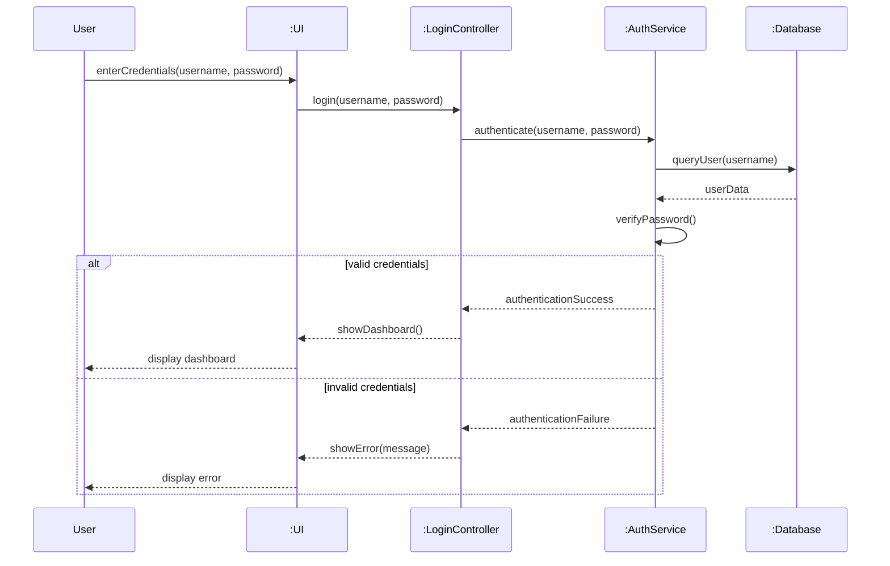
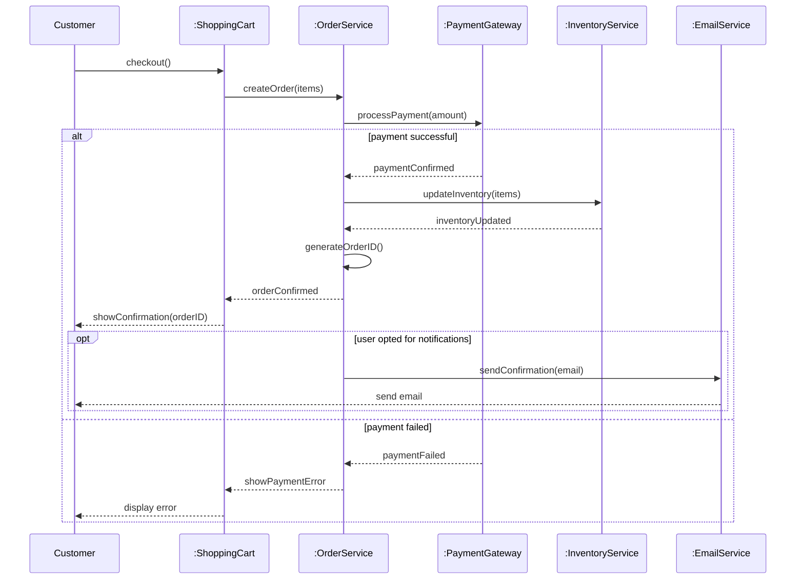

# UML Sequence Diagrams

## Learning Objectives
- Understand sequence diagram elements and notation
- Model object interactions over time
- Use combined fragments (alt, opt, loop, par)
- Create sequence diagrams for system scenarios

---

## 3.5 Sequence Diagrams

### What is a Sequence Diagram?

**DEF** A Sequence Diagram is a behavioral UML diagram that shows how objects interact with each other over time. It displays the sequence of messages exchanged between objects to complete a specific scenario.

### Key Characteristics
- **Time-ordered**: Messages read from top to bottom = chronological order
- **Object-focused**: Shows specific object instances
- **Scenario-based**: Represents one use case scenario
- **Dynamic model**: Shows behavior, not structure

---

## Sequence Diagram Elements

| Element | Symbol | Description | Example |
|---------|--------|-------------|---------|
| **Object/Lifeline** | Box with dashed line | Object instance participating in interaction | `:Customer`, `user1:User` |
| **Activation Bar** | Thin rectangle on lifeline | Period when object is active/processing | Rectangle during method execution |
| **Message** | Horizontal arrow | Communication between objects | `login(username, password)` |
| **Return Message** | Dashed arrow | Response from called object | `return true` |
| **Self Message** | Arrow looping back | Object calls its own method | `validateInput()` |
| **Combined Fragment** | Box with operator | Conditional/loop behavior | alt, opt, loop, par |

---

## Message Types

**★ EXAM** Different message types:

| Type | Arrow | Meaning | Example |
|------|-------|---------|---------|
| **Synchronous** | Solid arrow with filled head | Caller waits for response | Method call |
| **Asynchronous** | Solid arrow with open head | Caller continues without waiting | Event notification |
| **Return** | Dashed arrow with open head | Response from called object | Return value |
| **Create** | Dashed arrow with «create» | Creates new object | `«create» new Order()` |
| **Delete** | X at end of lifeline | Destroys object | `delete()` |

### Message Examples

```
Synchronous:    [Object A] ────────▶ [Object B]
                    login(username, password)

Asynchronous:   [Object A] ───────▷ [Object B]
                    sendNotification()

Return:         [Object A] ◀ - - - [Object B]
                    return true

Create:         [Object A] - - - - ▶ [Object B]
                    «create»
```

---

## Combined Fragments

**DEF** Combined fragments specify conditional, alternative, or repetitive behavior in sequence diagrams.

### Common Operators

| Operator | Meaning | Equivalent | Example |
|----------|---------|------------|---------|
| **alt** | Alternative (if-else) | if-then-else | Login success OR failure |
| **opt** | Optional (if) | if statement | Send email if opted in |
| **loop** | Repetition | for/while loop | Process all items |
| **par** | Parallel | Concurrent execution | Multiple independent tasks |
| **ref** | Reference | Method call | Reference to another diagram |

### 1. Alt (Alternative)

```
┌─────────────────────────┐
│         alt             │
├─────────────────────────┤
│ [valid credentials]     │
│ → authenticateUser()    │
│ → showDashboard()       │
├─────────────────────────┤
│ [invalid credentials]   │
│ → showError()           │
└─────────────────────────┘
```

### 2. Opt (Optional)

```
┌─────────────────────────┐
│         opt             │
│ [user opted in]         │
├─────────────────────────┤
│ → sendEmail()           │
│ → updatePreferences()   │
└─────────────────────────┘
```

### 3. Loop (Repetition)

```
┌─────────────────────────┐
│    loop [for each item] │
├─────────────────────────┤
│ → processItem()         │
│ → updateInventory()     │
└─────────────────────────┘
```

---

## Complete Example: User Login

### Scenario
User attempts to login with username and password.

### Mermaid Diagram



### Explanation
1. User enters credentials in UI
2. UI sends login request to Controller
3. Controller calls Authentication Service
4. Auth Service queries Database
5. Database returns user data
6. Auth Service verifies password
7. **Alt fragment**: Two possible outcomes
   - Valid: Show dashboard
   - Invalid: Show error message

---

## Complete Example: Online Shopping

### Scenario: Place Order



---

## Steps to Create Sequence Diagram

1. **Identify the scenario**: Which use case scenario are you modeling?
2. **Identify participating objects**: What objects are involved?
3. **Arrange objects horizontally**: Place objects across the top
4. **Add lifelines**: Draw dashed lines down from each object
5. **Add messages in sequence**: Top to bottom = time order
6. **Add activation bars**: Show when objects are active
7. **Add combined fragments**: For conditionals, loops, etc.
8. **Add return messages**: Show responses (optional but helpful)
9. **Review**: Check message sequence makes sense

---

## Best Practices

### DO's ✅
- Show messages in chronological order (top to bottom)
- Name objects clearly: `objectName:ClassName`
- Use activation bars to show processing time
- Include return messages for important responses
- Use combined fragments for complex logic
- Keep diagrams focused on one scenario

### DON'Ts ❌
- Don't show every single message (keep it readable)
- Don't mix multiple scenarios in one diagram
- Don't show internal object processing details
- Don't confuse message types (sync vs async)
- Don't make diagrams too wide (too many objects)

---

## Sequence Diagram vs Collaboration Diagram

| Aspect | Sequence Diagram | Collaboration Diagram |
|--------|-----------------|----------------------|
| **Focus** | Time ordering | Object relationships |
| **Layout** | Time flows vertically | Objects arranged freely |
| **Shows** | When messages occur | How objects are connected |
| **Numbering** | Implicit (top to bottom) | Explicit message numbers |
| **Best for** | Understanding flow | Understanding structure |

---

## Practice Questions

### MCQs

**Q1. In sequence diagrams, time flows:**  
a) Left to right  
b) Right to left  
c) Top to bottom  
d) Bottom to top  
**Answer: c) Top to bottom**

**Q2. The «alt» combined fragment represents:**  
a) Loop  
b) Optional behavior  
c) Alternative paths (if-else)  
d) Parallel execution  
**Answer: c) Alternative paths (if-else)**

**Q3. A solid arrow with filled arrowhead represents:**  
a) Asynchronous message  
b) Synchronous message  
c) Return message  
d) Create message  
**Answer: b) Synchronous message**

**Q4. An activation bar shows:**  
a) Object creation  
b) Period when object is active/processing  
c) Object destruction  
d) Message type  
**Answer: b) Period when object is active/processing**

**Q5. Which combined fragment is used for repetition?**  
a) alt  
b) opt  
c) loop  
d) par  
**Answer: c) loop**

---

### Short Answer Questions

**Q1. Draw a sequence diagram for withdrawing cash from ATM.**  
**Answer:**

```
Participants: User, ATM, BankServer, Account, CashDispenser

Sequence:
1. User → ATM: insertCard()
2. ATM → BankServer: validateCard(cardNumber)
3. BankServer → BankServer: checkValidity()
4. BankServer -->> ATM: cardValid
5. ATM → User: enterPIN()
6. User → ATM: enterPIN(pin)
7. ATM → BankServer: authenticate(pin)
8. BankServer -->> ATM: authenticated
9. ATM → User: selectTransaction()
10. User → ATM: selectWithdraw(amount)
11. ATM → BankServer: checkBalance(account, amount)
12. BankServer → Account: getBalance()
13. Account -->> BankServer: balance
14. 
    alt sufficient balance
        BankServer → Account: debit(amount)
        BankServer -->> ATM: approved
        ATM → CashDispenser: dispenseCash(amount)
        CashDispenser -->> ATM: cashDispensed
        ATM → User: collectCash()
        ATM → User: printReceipt()
    else insufficient balance
        BankServer -->> ATM: insufficientFunds
        ATM → User: showError("Insufficient balance")
    end
```

**Q2. What are combined fragments? Give examples.**  
**Answer:**
Combined fragments specify conditional, alternative, or repetitive behavior.

**Examples:**
- **alt**: If-else logic (login success OR failure)
- **opt**: Optional behavior (send email if user opted in)
- **loop**: Repetition (process all order items)
- **par**: Parallel execution (send notifications while processing order)
- **ref**: Reference to another sequence diagram

**Q3. Differentiate between synchronous and asynchronous messages.**  
**Answer:**

| Synchronous | Asynchronous |
|-------------|--------------|
| Caller waits for response | Caller continues without waiting |
| Solid arrow with filled head | Solid arrow with open head |
| Method calls | Event notifications |
| Blocking | Non-blocking |
| Example: `login()` waits for result | Example: `sendNotification()` fires and forgets |

---

## Exam Tips

1. **Time flows top to bottom**: Always mention this
2. **Memorize message types**: Synchronous, asynchronous, return, create
3. **Combined fragments**: alt (if-else), opt (if), loop (for/while)
4. **Arrow heads matter**: Filled = sync, open = async
5. **Practice diagrams**: Login, ATM, Shopping scenarios
6. **Activation bars**: Show processing time
7. **Keep it simple**: Don't overcomplicate with too many objects

---

## Textbook References
- Rajib Mall: Chapter 7 (Object-Oriented Software Engineering)
- Pressman: Chapter 9 (Modeling Requirements)

---

**Previous Topic**: [UML Class Diagrams](03_UML_Class_Diagrams.md)  
**Next Topic**: [UML Activity Diagrams](05_UML_Activity_Diagrams.md)
