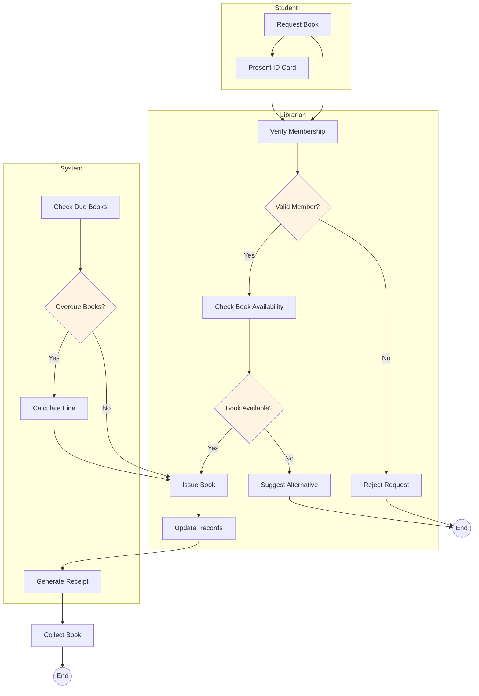

# UML Activity Diagrams

## Learning Objectives
- Understand activity diagram elements and notation
- Model workflow and business processes
- Use swimlanes to show responsibility
- Create activity diagrams for complex processes

---

## 3.6 Activity Diagrams

### What is an Activity Diagram?

**DEF** An Activity Diagram is a behavioral UML diagram that shows the workflow of activities from start to end. It represents the flow of control and data through a system, similar to a flowchart but with more capabilities.

### Purpose
- Model business processes and workflows
- Show parallel/concurrent activities
- Represent decision points and branches
- Document use case scenarios
- Show who does what (using swimlanes)

---

## Activity Diagram Elements

| Element | Symbol | Description | Example |
|---------|--------|-------------|---------|
| **Start Node** | Filled circle (●) | Beginning of workflow | Process starts here |
| **End Node** | Bullseye (◉) | End of workflow | Process completes |
| **Activity/Action** | Rounded rectangle | Task or operation | "Validate Input", "Process Order" |
| **Decision/Merge** | Diamond (◇) | Conditional branching | if-else logic |
| **Fork** | Thick horizontal bar | Split into parallel flows | Start concurrent tasks |
| **Join** | Thick horizontal bar | Merge parallel flows | Wait for all tasks |
| **Swimlane** | Partitioned area | Shows responsible actor | Customer lane, System lane |
| **Object Node** | Rectangle | Data/object flowing | Order, Payment Info |
| **Flow** | Arrow | Transition between activities | Control flow direction |

---

## Basic Activity Diagram Example

### Scenario: User Registration

```mermaid
graph TD
    Start((●)) --> A[Enter Registration Details]
    A --> B{Valid Input?}
    B -->|Yes| C[Check Email Availability]
    B -->|No| D[Show Error Message]
    D --> A
    C --> E{Email Available?}
    E -->|Yes| F[Create Account]
    E -->|No| G[Show Email Taken Error]
    G --> A
    F --> H[Send Confirmation Email]
    H --> I[Show Success Message]
    I --> End((◉))
    
    style Start fill:#000000
    style End fill:#000000
    style B fill:#fff4e1
    style E fill:#fff4e1
```



---

## Decision and Merge Nodes

### Decision Node
- **Symbol**: Diamond (◇)
- **Purpose**: Branch based on condition
- **Multiple outgoing flows**: Each with guard condition
- **One incoming flow**

### Example: Order Processing Decision

```
           [Order Received]
                 |
                 ▼
            ◇ Order Type?
            /          \
  [Regular] /            \ [Express]
          /              \
         ▼                ▼
  [Process Regular]  [Process Express]
```

### Guard Conditions
- Written in square brackets: `[condition]`
- Examples: `[valid]`, `[amount > 1000]`, `[user == admin]`

---

## Fork and Join (Parallel Processing)

### Fork Node
- **Symbol**: Thick horizontal bar
- **Purpose**: Split single flow into multiple parallel flows
- **One incoming, multiple outgoing**

### Join Node
- **Symbol**: Thick horizontal bar (same as fork)
- **Purpose**: Wait for all parallel flows to complete
- **Multiple incoming, one outgoing**

### Example: Order Fulfillment with Parallel Tasks

```mermaid
graph TD
    A[Order Placed] --> B[Fork]
    B --> C[Process Payment]
    B --> D[Update Inventory]
    B --> E[Send Confirmation Email]
    C --> F[Join]
    D --> F
    E --> F
    F --> G[Ship Order]
    G --> H((End))
    
    style B fill:#000000
    style F fill:#000000
```



**Explanation:**
After order is placed, three tasks happen **in parallel**:
1. Process Payment
2. Update Inventory  
3. Send Confirmation Email

All three must complete before shipping the order.

---

## Swimlanes

**DEF** Swimlanes partition activities by responsible actor, component, or department. They show **who does what** in a process.

### Purpose
- Clarify responsibilities
- Show interactions between actors
- Identify handoffs
- Improve process understanding

### Example: Online Shopping with Swimlanes

```
┌─────────────┬──────────────────┬──────────────┐
│  Customer   │     System       │    Bank      │
├─────────────┼──────────────────┼──────────────┤
│             │                  │              │
│ Browse      │                  │              │
│ Products    │                  │              │
│      │      │                  │              │
│      ▼      │                  │              │
│ Add to Cart │                  │              │
│      │      │                  │              │
│      ▼      │                  │              │
│  Checkout   │                  │              │
│             │ Verify Inventory │              │
│             │      │           │              │
│             │      ▼           │              │
│             │ Process Payment ────────────►   │
│             │                  │  Validate    │
│             │                  │    Card      │
│             │                  │      │       │
│             │◄─────────────────│      ▼       │
│             │  Payment Result  │              │
│             │      │           │              │
│             │      ▼           │              │
│             │ Confirm Order   │              │
│      │      │                  │              │
│      ▼      │                  │              │
│ Receive     │                  │              │
│Confirmation │                  │              │
└─────────────┴──────────────────┴──────────────┘
```

---

## Complete Example: Library Book Issue Process

### Scenario with Swimlanes



---

## Activity Diagram vs Flowchart

| Aspect | Activity Diagram | Flowchart |
|--------|-----------------|-----------|
| **Parallellism** | Supports fork/join | Limited |
| **Swimlanes** | Yes | No |
| **Object Flow** | Shows data objects | No |
| **UML Standard** | Yes | No |
| **Complexity** | Handles complex workflows | Simple processes only |
| **Start/End** | Filled circle, bullseye | Oval/rounded rectangle |

---

## Steps to Create Activity Diagram

1. **Identify the process**: What workflow are you modeling?
2. **Identify start and end points**: Where does it begin and end?
3. **List activities**: What actions/tasks are performed?
4. **Identify decisions**: Where does the flow branch?
5. **Identify parallel activities**: Can tasks happen concurrently?
6. **Determine responsibilities**: Who performs each activity? (swimlanes)
7. **Draw the diagram**: Start → Activities → Decisions → End
8. **Add guard conditions**: Label decision branches
9. **Review**: Verify flow makes logical sense

---

## Best Practices

### DO's ✅
- Use clear, action-oriented names for activities
- Include guard conditions on decision branches
- Use swimlanes when multiple actors are involved
- Show parallel flows with fork/join when applicable
- Keep diagrams readable (not too complex)
- Use object nodes to show important data flow

### DON'Ts ❌
- Don't create overly complex diagrams
- Don't forget end nodes
- Don't mix different levels of abstraction
- Don't skip guard conditions on decisions
- Don't use activity diagrams for simple linear processes (use flowchart)

---

## Practice Questions

### MCQs

**Q1. In activity diagrams, a diamond symbol represents:**  
a) Start node  
b) End node  
c) Decision/merge node  
d) Activity  
**Answer: c) Decision/merge node**

**Q2. Swimlanes are used to:**  
a) Show parallel processing  
b) Show decision points  
c) Show who is responsible for activities  
d) Show data flow  
**Answer: c) Show who is responsible for activities**

**Q3. A thick horizontal bar in activity diagrams represents:**  
a) Decision node  
b) Activity  
c) Fork/join node  
d) End node  
**Answer: c) Fork/join node**

**Q4. The end node in activity diagrams is represented by:**  
a) Filled circle  
b) Bullseye (circle with dot)  
c) Rectangle  
d) Diamond  
**Answer: b) Bullseye (circle with dot)**

**Q5. Guard conditions are written in:**  
a) Parentheses ()  
b) Curly braces {}  
c) Square brackets []  
d) Angle brackets <>  
**Answer: c) Square brackets []**

---

### Short Answer Questions

**Q1. Draw an activity diagram for ATM cash withdrawal.**  
**Answer:**

```
Start → Insert Card → Enter PIN → {Valid PIN?}
  ├─ No → Show Error → Eject Card → End
  └─ Yes → Select Transaction → {Transaction Type?}
       ├─ Withdraw Cash → Enter Amount → {Sufficient Balance?}
       │    ├─ No → Show Error → {Another Transaction?}
       │    └─ Yes → Dispense Cash → Print Receipt → {Another Transaction?}
       ├─ Check Balance → Show Balance → {Another Transaction?}
       └─ Deposit Cash → Insert Cash → Count Cash → Credit Account → {Another Transaction?}
            ├─ Yes → Select Transaction
            └─ No → Eject Card → End
```

**Q2. What are swimlanes? Why are they useful?**  
**Answer:**
Swimlanes are partitions in activity diagrams that show which actor, department, or component is responsible for each activity.

**Benefits:**
1. **Clarity**: Shows who does what
2. **Responsibility**: Identifies accountable parties
3. **Handoffs**: Highlights transitions between actors
4. **Process Improvement**: Identifies bottlenecks
5. **Communication**: Easy for stakeholders to understand

**Example**: In online shopping:
- Customer lane: Browse, Add to cart, Checkout
- System lane: Verify inventory, Process order
- Bank lane: Validate payment, Transfer funds

**Q3. Differentiate between fork and join nodes.**  
**Answer:**

| Fork Node | Join Node |
|-----------|-----------|
| Splits one flow into multiple parallel flows | Merges multiple parallel flows into one |
| One incoming, multiple outgoing | Multiple incoming, one outgoing |
| Starts concurrent execution | Waits for all concurrent tasks to complete |
| Example: Start payment, inventory, email in parallel | Example: Wait for all three before shipping |

---

## Exam Tips

1. **Memorize symbols**: Start (●), End (◉), Decision (◇), Fork/Join (thick bar)
2. **Swimlanes**: Draw when question mentions multiple actors/departments
3. **Guard conditions**: Always label decision branches [condition]
4. **Fork/Join**: Use for parallel processing questions
5. **Practice scenarios**: Order processing, login, registration
6. **Action names**: Use verb phrases (Validate, Process, Send)
7. **Keep it logical**: Flow should make business sense

---

## Textbook References
- Rajib Mall: Chapter 7 (Object-Oriented Software Engineering)
- Pressman: Chapter 9 (Modeling Requirements)

---

**Previous Topic**: [UML Sequence Diagrams](04_UML_Sequence_Diagrams.md)  
**Next Topic**: [Model Validation](06_Model_Validation.md)
