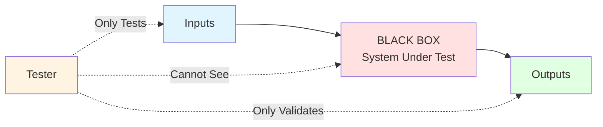

# Black Box Testing - Complete Guide

## 📚 Learning Objectives
- Understand black box testing principles
- Apply Equivalence Partitioning technique
- Apply Boundary Value Analysis technique
- Design effective test cases without seeing code
- Create decision tables

---

## 1. What is Black Box Testing?

**Black Box Testing** (also called **Behavioral Testing** or **Functional Testing**) is a testing technique where the tester tests the functionality of the software **without looking at the internal code structure**.

### Key Characteristics:
- Tests **what** the system does, not **how** it does it
- Based on requirements and specifications
- No knowledge of internal implementation
- Performed by independent testers (not developers)
- Focuses on inputs and outputs

### Mermaid Diagram - Black Box Concept:

### What Tester Knows:
✅ Requirements specification  
✅ Functional specifications  
✅ Input data types  
✅ Expected outputs  

### What Tester Doesn't Know:
❌ Source code  
❌ Internal logic  
❌ Implementation details  
❌ Data structures  

---

## 2. Equivalence Partitioning (EP)

### Definition
**Equivalence Partitioning** divides input data into **equivalence classes** where all values in a class are expected to be processed the same way. You test **one value from each class**.

### Principle
If one value in a class works, all values in that class should work. If one fails, all should fail.

### Steps to Apply EP:
1. Identify input conditions
2. Divide into valid and invalid equivalence classes
3. Select one representative value from each class
4. Create test cases

### Example 1: Age Validation (18-60 years)

**Input Condition**: Age must be between 18 and 60 (inclusive)

**Equivalence Classes**:

| Class Type | Range | Equivalence Class | Test Value |
|------------|-------|-------------------|------------|
| **Valid** | 18 ≤ Age ≤ 60 | [18, 60] | 30 |
| **Invalid** (below) | Age < 18 | (-∞, 17] | 10 |
| **Invalid** (above) | Age > 60 | [61, +∞) | 70 |

**Test Cases**:

| Test Case ID | Input (Age) | Expected Result | Equivalence Class |
|--------------|-------------|-----------------|-------------------|
| TC-01 | 30 | Valid - Accept | Valid class |
| TC-02 | 10 | Invalid - Reject | Invalid (below) |
| TC-03 | 70 | Invalid - Reject | Invalid (above) |

### Example 2: Password Field (6-12 characters)

**Equivalence Classes**:

| Class | Range | Test Value | Expected |
|-------|-------|------------|----------|
| Valid | 6-12 chars | 8 chars | Accept |
| Invalid (too short) | 1-5 chars | 3 chars | Reject |
| Invalid (too long) | 13+ chars | 15 chars | Reject |

### Example 3: Multiple Conditions

**Problem**: A student can appear for exam if:
- Attendance ≥ 75%
- Assignment submission = Yes

**Equivalence Classes**:

| Condition | Valid Class | Invalid Class |
|-----------|-------------|---------------|
| Attendance | [75, 100] | [0, 74] |
| Assignment | Yes | No |

**Test Cases** (combine classes):

| TC | Attendance | Assignment | Expected |
|----|------------|------------|----------|
| TC-01 | 80% | Yes | Eligible |
| TC-02 | 60% | Yes | Not Eligible |
| TC-03 | 80% | No | Not Eligible |
| TC-04 | 60% | No | Not Eligible |

---

## 3. Boundary Value Analysis (BVA) ⭐ **VERY IMPORTANT**

### Definition
**Boundary Value Analysis** focuses on testing values **at the boundaries** of equivalence classes, as errors often occur at boundaries.

### Principle
If a system works correctly at boundaries, it will likely work correctly for values inside the boundaries.

### BVA Rule:
For a range [a, b], test:
- **a** (minimum boundary)
- **a-1** (just below minimum)
- **a+1** (just above minimum)
- **b** (maximum boundary)
- **b-1** (just below maximum)
- **b+1** (just above maximum)

**Total: 6 test values per range**

### Example 1: Age Validation (18-60 years)

**Boundaries**: 18 and 60

**Test Values**:

| Value | Position | Expected | Test Case |
|-------|----------|----------|-----------|
| 17 | Below min (18-1) | Invalid | TC-01 |
| **18** | **Min boundary** | **Valid** | **TC-02** |
| 19 | Above min (18+1) | Valid | TC-03 |
| 59 | Below max (60-1) | Valid | TC-04 |
| **60** | **Max boundary** | **Valid** | **TC-05** |
| 61 | Above max (60+1) | Invalid | TC-06 |

**Complete Test Cases**:

| TC ID | Input | Expected | Reason |
|-------|-------|----------|--------|
| TC-01 | 17 | Invalid | Below minimum |
| TC-02 | 18 | Valid | Minimum boundary |
| TC-03 | 19 | Valid | Inside range |
| TC-04 | 59 | Valid | Inside range |
| TC-05 | 60 | Valid | Maximum boundary |
| TC-06 | 61 | Invalid | Above maximum |

### Example 2: Array Index (1 to 100)

**Test Values**: 0, 1, 2, 99, 100, 101

| Value | Position | Result |
|-------|----------|--------|
| 0 | Below min | Error/Invalid |
| 1 | Min boundary | Valid |
| 2 | Just above min | Valid |
| 99 | Just below max | Valid |
| 100 | Max boundary | Valid |
| 101 | Above max | Error/Invalid |

### Example 3: Text Field (1-255 characters)

**Test Values**: 0, 1, 2, 254, 255, 256

| Characters | Position | Expected |
|------------|----------|----------|
| 0 | Below min | Reject (empty not allowed) |
| 1 | Min boundary | Accept |
| 2 | Above min | Accept |
| 254 | Below max | Accept |
| 255 | Max boundary | Accept |
| 256 | Above max | Reject (exceeds limit) |

---

## 4. BVA vs EP - Comparison

| Aspect | Equivalence Partitioning | Boundary Value Analysis |
|--------|-------------------------|------------------------|
| **Focus** | Entire range | Boundary values only |
| **Test Cases** | 1 per class | 6 per range |
| **Effectiveness** | Good | Better (catches more bugs) |
| **Usage** | General testing | Critical boundary testing |
| **Combination** | Used together | Used together |

**Best Practice**: Use **both EP and BVA together** for comprehensive testing.

---

## 5. Decision Table Testing

### Definition
**Decision Table Testing** is used when system behavior depends on **multiple conditions** that combine in different ways.

### Structure:
| Conditions | Rule 1 | Rule 2 | Rule 3 | ... |
|------------|--------|--------|--------|-----|
| Condition 1 | Y/N | Y/N | Y/N | ... |
| Condition 2 | Y/N | Y/N | Y/N | ... |
| **Actions** | | | | |
| Action 1 | X/- | X/- | X/- | ... |

### Example: Login System

**Conditions**:
1. Username valid?
2. Password valid?
3. Account active?

**Decision Table**:

| Conditions | Rule 1 | Rule 2 | Rule 3 | Rule 4 | Rule 5 | Rule 6 | Rule 7 | Rule 8 |
|------------|--------|--------|--------|--------|--------|--------|--------|--------|
| Username valid? | N | Y | Y | Y | Y | Y | Y | Y |
| Password valid? | - | N | Y | Y | Y | Y | Y | Y |
| Account active? | - | - | N | Y | Y | Y | Y | Y |
| **Actions** | | | | | | | | |
| Login success | - | - | - | ✓ | - | - | - | - |
| Error: Invalid username | ✓ | - | - | - | - | - | - | - |
| Error: Invalid password | - | ✓ | - | - | - | - | - | - |
| Error: Account inactive | - | - | ✓ | - | - | - | - | - |

**Test Cases**: Create one test case per rule (8 test cases).

---

## 6. State Transition Testing

### Definition
Tests system behavior when transitioning between different states based on events.

### Example: ATM PIN Entry

**States**:
- Idle
- Card Inserted
- PIN Entry (3 attempts allowed)
- Access Granted
- Card Blocked

**State Transition Table**:

| Current State | Event | Next State | Action |
|---------------|-------|------------|--------|
| Idle | Insert Card | Card Inserted | Read card |
| Card Inserted | Enter PIN (valid) | Access Granted | Allow transaction |
| Card Inserted | Enter PIN (invalid, 1st) | PIN Entry | Retry (2 left) |
| Card Inserted | Enter PIN (invalid, 2nd) | PIN Entry | Retry (1 left) |
| Card Inserted | Enter PIN (invalid, 3rd) | Card Blocked | Block card |
| Card Blocked | Any | Card Blocked | Contact bank |

---

## 7. Complete Example: Student Grade System

**Problem**: Calculate grade based on marks (0-100)

| Marks Range | Grade |
|-------------|-------|
| 90-100 | A |
| 80-89 | B |
| 70-79 | C |
| 60-69 | D |
| 0-59 | F |

### Equivalence Partitioning:

| Grade | Valid Class | Test Value |
|-------|-------------|------------|
| A | [90, 100] | 95 |
| B | [80, 89] | 85 |
| C | [70, 79] | 75 |
| D | [60, 69] | 65 |
| F | [0, 59] | 50 |
| Invalid | <0 or >100 | -5, 105 |

### Boundary Value Analysis:

**Boundaries**: 0, 60, 70, 80, 90, 100

**Test Values**: -1, 0, 1, 59, 60, 61, 69, 70, 71, 79, 80, 81, 89, 90, 91, 99, 100, 101

### Complete Test Cases:

| TC | Marks | Expected Grade | Technique |
|----|-------|----------------|-----------|
| TC-01 | -1 | Error | BVA |
| TC-02 | 0 | F | BVA (min) |
| TC-03 | 1 | F | BVA |
| TC-04 | 50 | F | EP |
| TC-05 | 59 | F | BVA |
| TC-06 | 60 | D | BVA |
| TC-07 | 61 | D | BVA |
| TC-08 | 65 | D | EP |
| TC-09 | 69 | D | BVA |
| TC-10 | 70 | C | BVA |
| TC-11 | 75 | C | EP |
| TC-12 | 80 | B | BVA |
| TC-13 | 85 | B | EP |
| TC-14 | 90 | A | BVA |
| TC-15 | 95 | A | EP |
| TC-16 | 100 | A | BVA (max) |
| TC-17 | 101 | Error | BVA |

---

## 📝 Practice Questions

### MCQs:

**Q1. Black box testing is also known as:**  
a) Structural testing  
b) Behavioral testing  
c) Glass box testing  
d) White box testing  
**Answer: b) Behavioral testing**

**Q2. In BVA, for range [10, 50], which values are tested?**  
a) 10, 50  
b) 9, 10, 50, 51  
c) 9, 10, 11, 49, 50, 51  
d) 10, 25, 50  
**Answer: c) 9, 10, 11, 49, 50, 51**

**Q3. Equivalence partitioning:**  
a) Tests all values  
b) Tests boundary values only  
c) Tests one value from each class  
d) Tests random values  
**Answer: c) Tests one value from each class**

**Q4. How many test cases in BVA for a single range?**  
a) 2  
b) 4  
c) 6  
d) 8  
**Answer: c) 6**

**Q5. Decision table testing is useful when:**  
a) Single input condition  
b) Multiple conditions combine  
c) Testing boundaries  
d) Testing loops  
**Answer: b) Multiple conditions combine**

---

### Short Answer Questions:

**Q1. Apply BVA to test a function that accepts values from 1 to 100.**  
**Answer:**

| TC | Value | Expected | Reason |
|----|-------|----------|--------|
| TC-01 | 0 | Invalid | Below minimum (1-1) |
| TC-02 | 1 | Valid | Minimum boundary |
| TC-03 | 2 | Valid | Just above minimum |
| TC-04 | 99 | Valid | Just below maximum |
| TC-05 | 100 | Valid | Maximum boundary |
| TC-06 | 101 | Invalid | Above maximum (100+1) |

**Q2. Differentiate between EP and BVA.**  
**Answer:** (Use comparison table from Section 4)

**Q3. Why do errors occur frequently at boundaries?**  
**Answer:**
- Off-by-one errors (< vs ≤)
- Incorrect loop boundaries
- Array index out of bounds
- Incorrect conditional operators
- Edge cases not considered
- Rounding errors

---

## 🔥 Exam Tips

1. **Always show equivalence classes in table format**
2. **For BVA, explicitly mention all 6 values** (a-1, a, a+1, b-1, b, b+1)
3. **Create proper test case tables** with TC ID, Input, Expected Output
4. **Draw diagrams** for state transition questions
5. **Combine EP and BVA** for comprehensive answers
6. **Remember**: BVA catches more bugs than EP alone
7. **Show calculations** for decision tables (2^n rules for n conditions)

---

**Previous Topic**: [Testing Fundamentals](01_Testing_Fundamentals.md)  
**Next Topic**: [White Box Testing](03_White_Box_Testing.md)
